# Activity Diagram UML Berdasarkan Use Case - Versi Swimlane

Dokumen ini berisi 15 activity diagram PlantUML berdasarkan 15 use case utama sistem.

Catatan:
- Diagram menggunakan swimlane untuk memisahkan aktor dan sistem.
- Alur dibuat ringkas agar mudah dimasukkan ke laporan tugas akhir.
- Detail teknis seperti query, cache, token internal, dan struktur tabel tidak ditampilkan.

## 1. Melakukan Pemesanan Melalui QR Meja

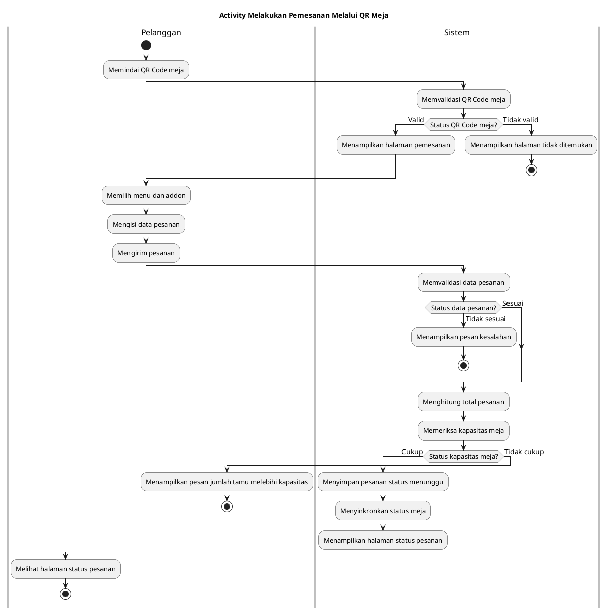

## 2. Melihat Status Pesanan

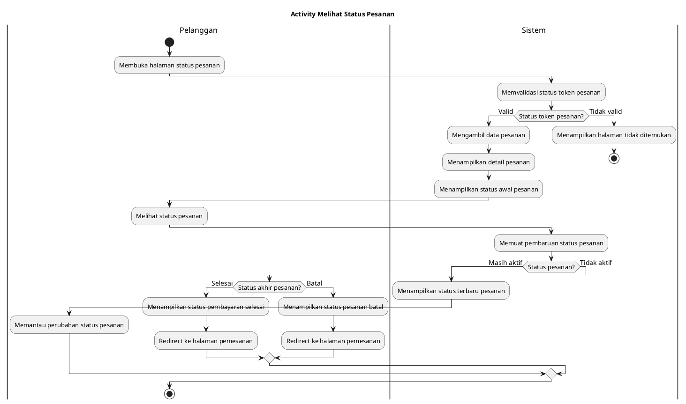

## 3. Mengubah Pesanan

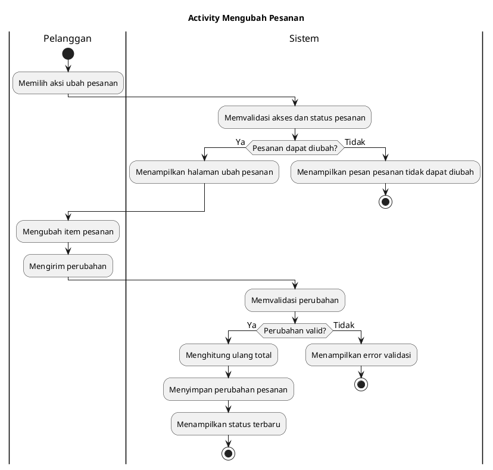

## 4. Membatalkan Pesanan

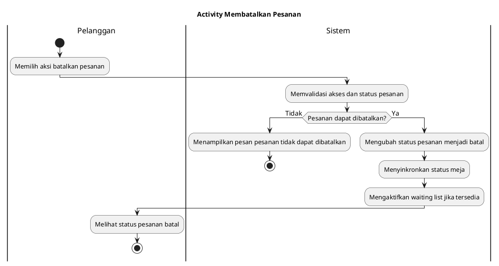

## 5. Membuat Waiting List

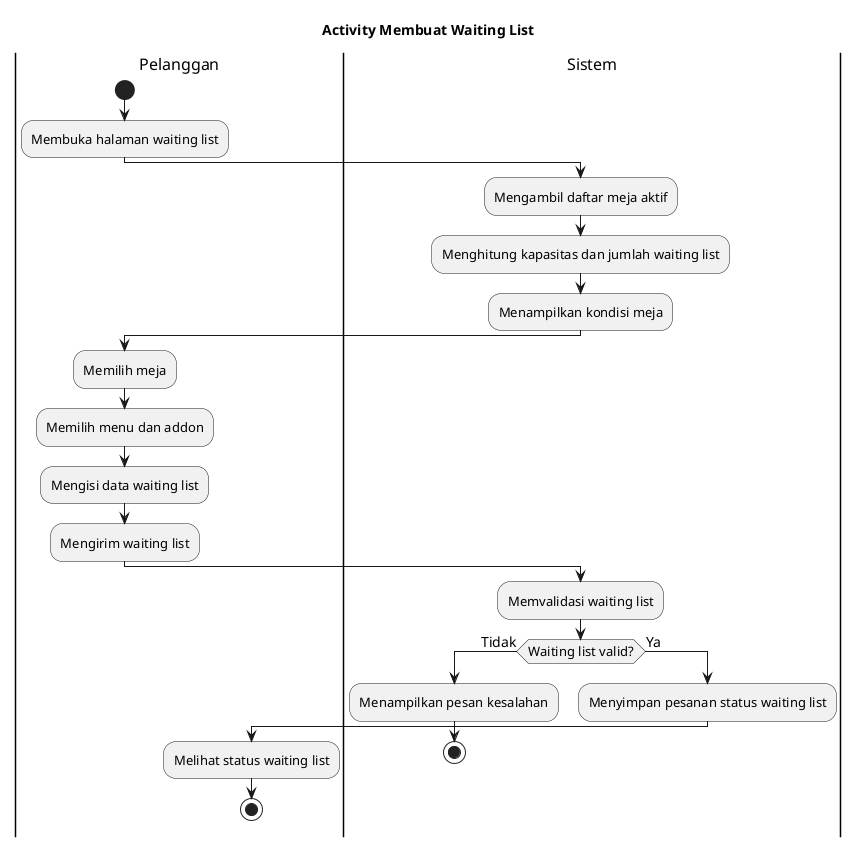

## 6. Melakukan Login

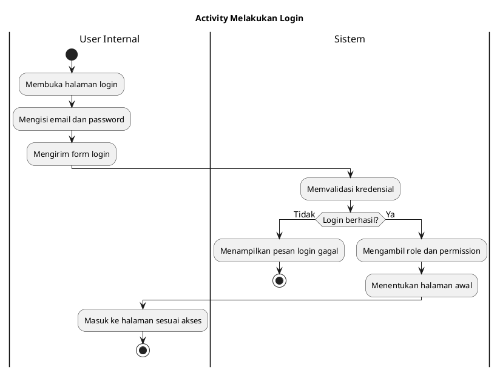

## 7. Melihat Dashboard

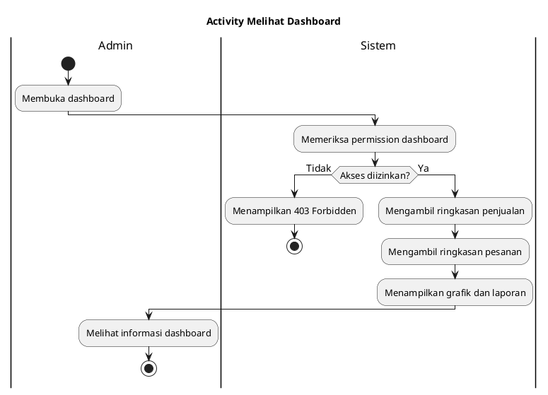

## 8. Mengelola Pesanan

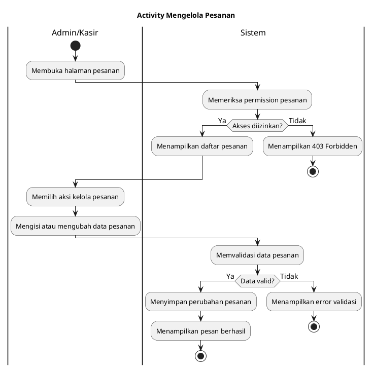

## 9. Mengelola Kitchen Display

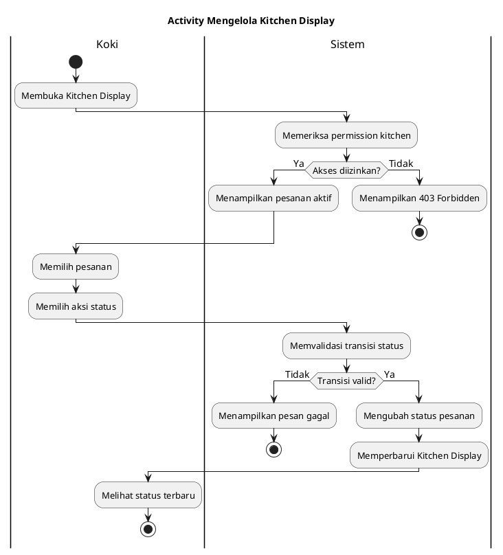

## 10. Mengelola Pembayaran

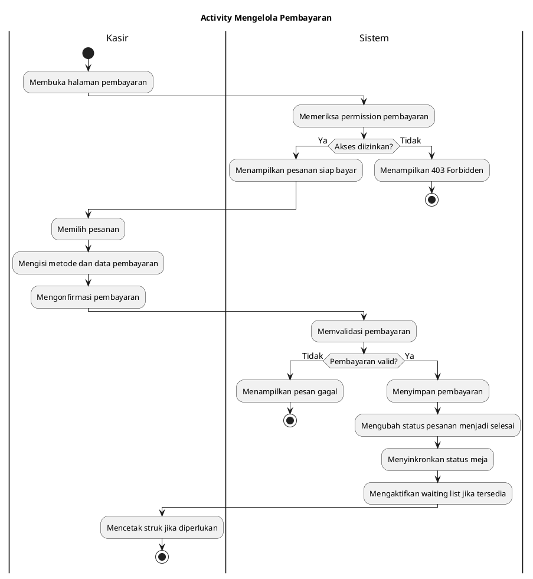

## 11. Mengelola Waiting List

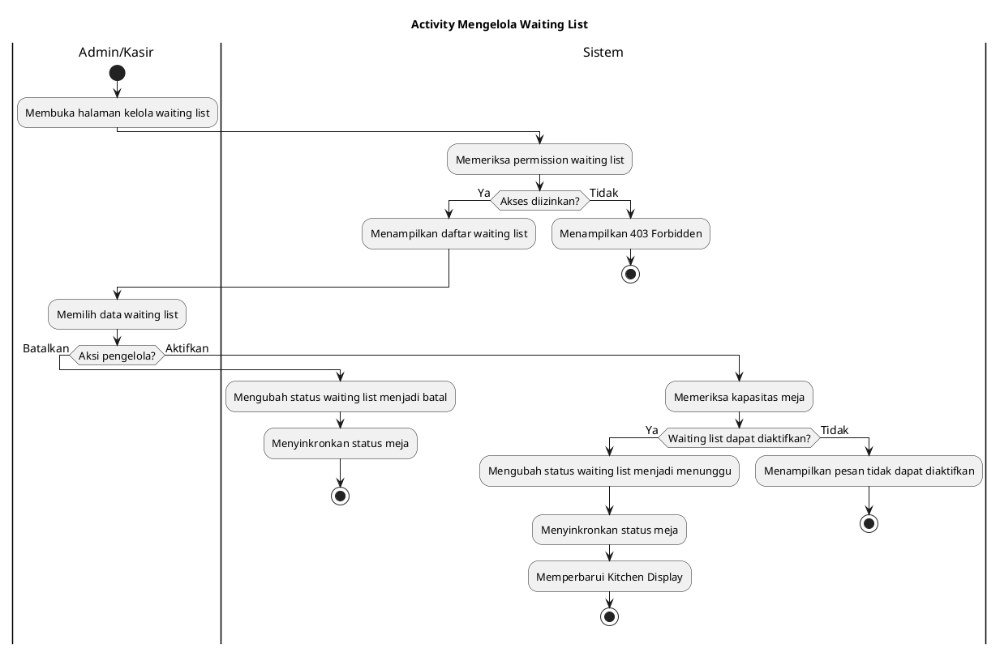

## 12. Mengelola Menu dan Addon

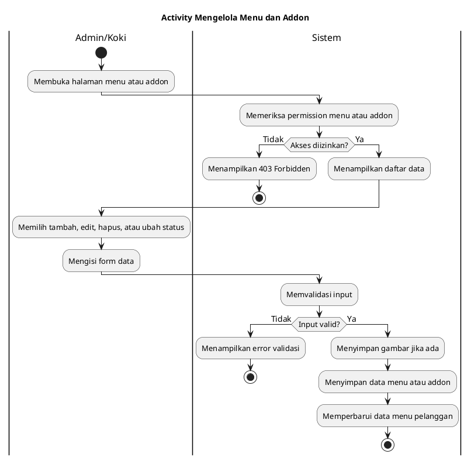

## 13. Mengelola Data Referensi

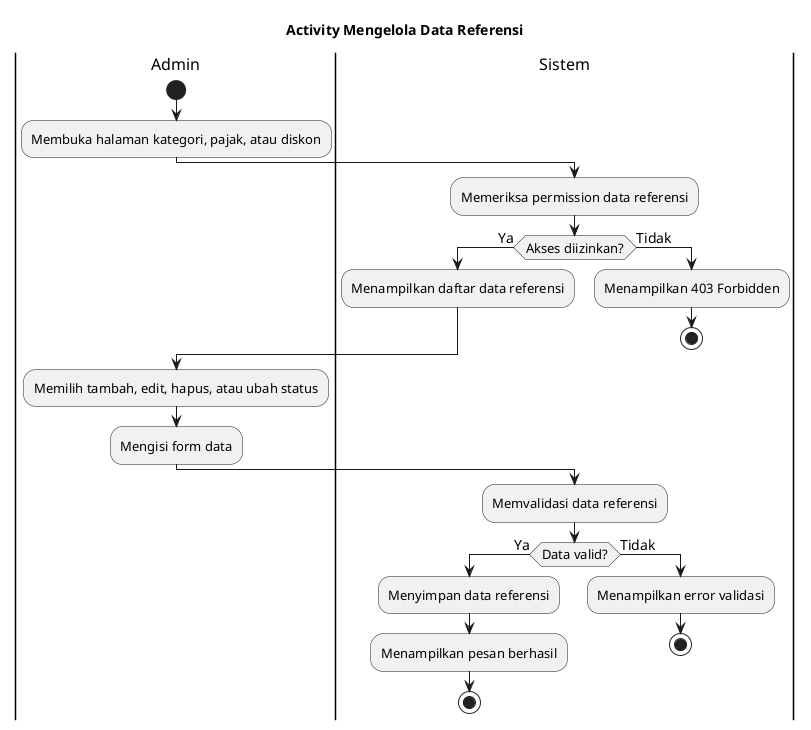

## 14. Mengelola Meja dan QR Code

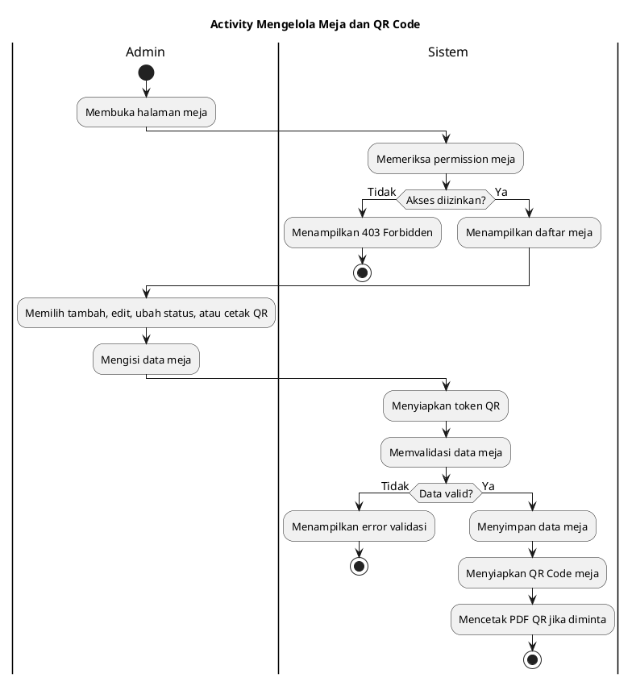

## 15. Mengelola User dan Hak Akses

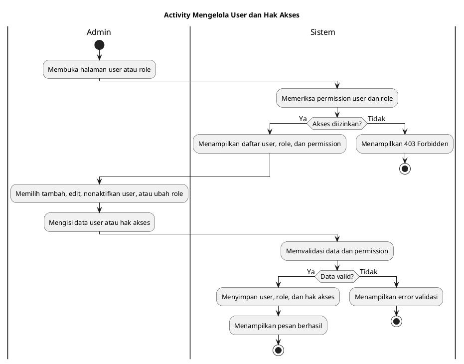
