# Activity Diagram UML Warung Baleganjur - Versi Swimlane Ringkas

Dokumen ini berisi 11 Activity Diagram inti dalam bentuk PlantUML swimlane untuk laporan tugas akhir.

Tujuan versi ini:
- Memisahkan aktivitas berdasarkan aktor agar alur mudah dipahami.
- Hanya menampilkan proses penting yang mewakili project.
- Detail teknis seperti cache, query database, token internal, dan relasi pivot diringkas.
- Flow yang terlalu padat dipecah menjadi diagram terpisah.

Style umum yang digunakan:
- `skinparam defaultFontName Arial`
- `skinparam defaultFontSize 14`
- `skinparam activityFontSize 13`
- `skinparam swimlaneTitleFontSize 16`

## 1. Login dan Pengalihan Berdasarkan Permission

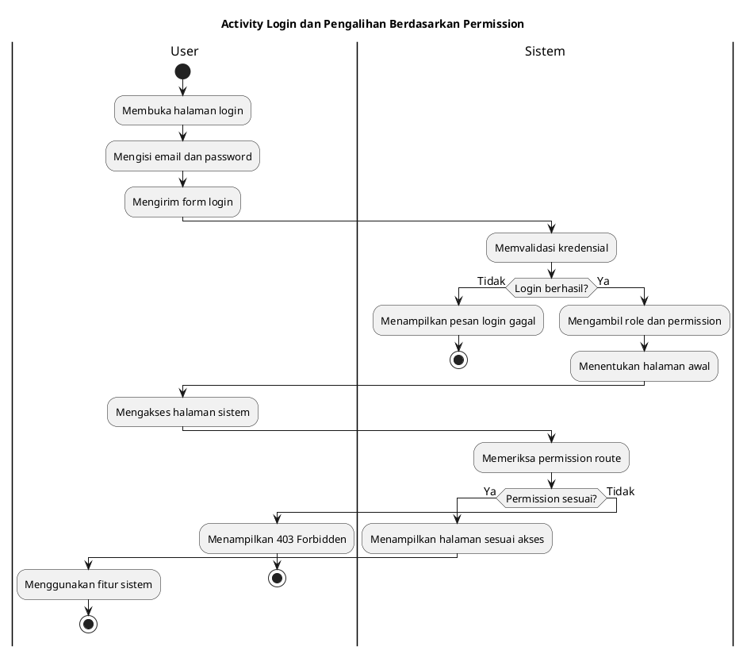

## 2. Customer Scan QR dan Melihat Menu

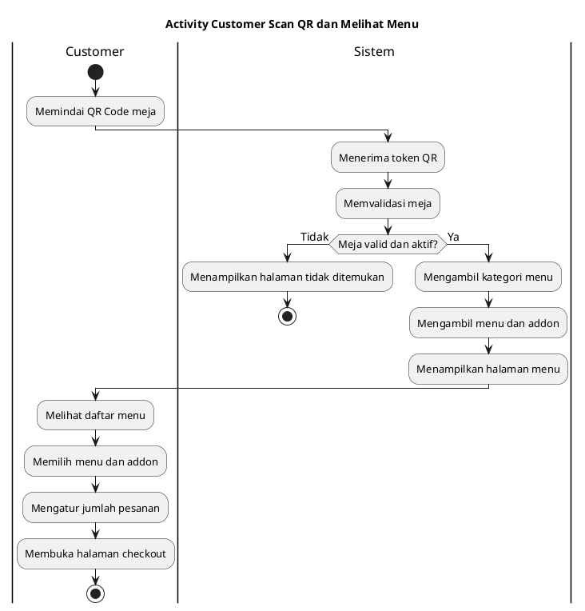

## 3. Checkout dan Penyimpanan Pesanan Customer

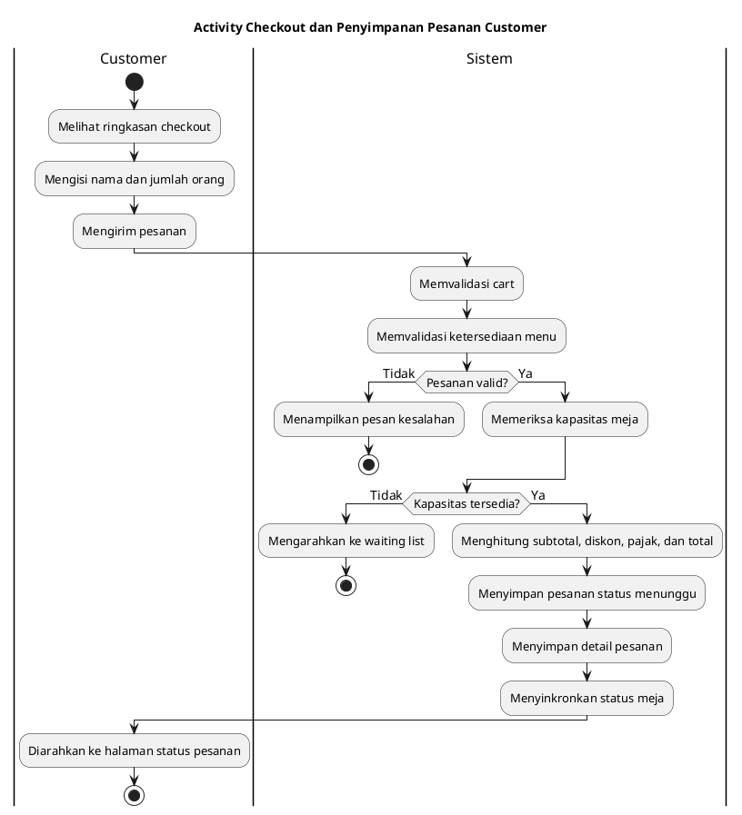

## 4. Pemantauan Status Pesanan oleh Customer

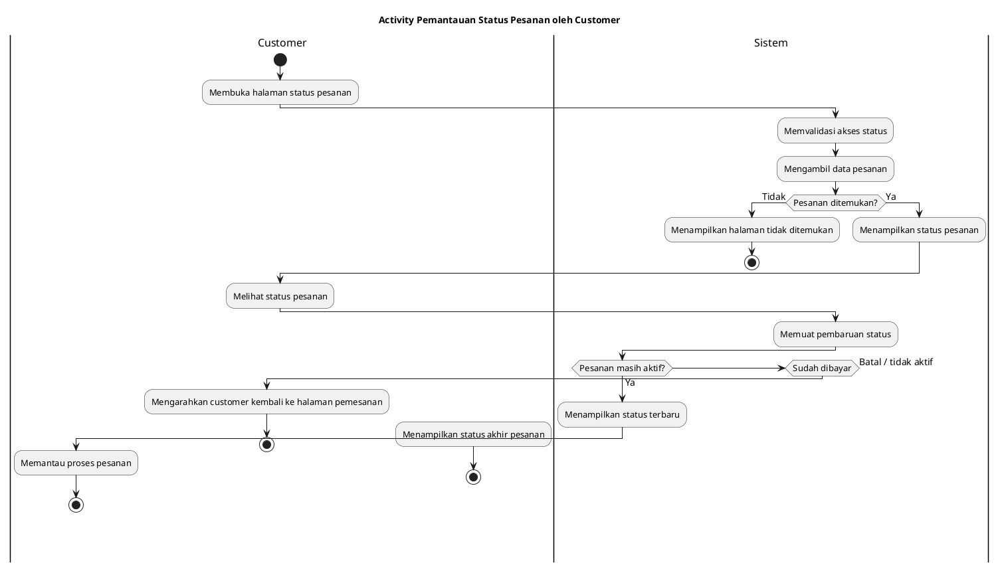

## 5. Edit atau Pembatalan Pesanan oleh Customer

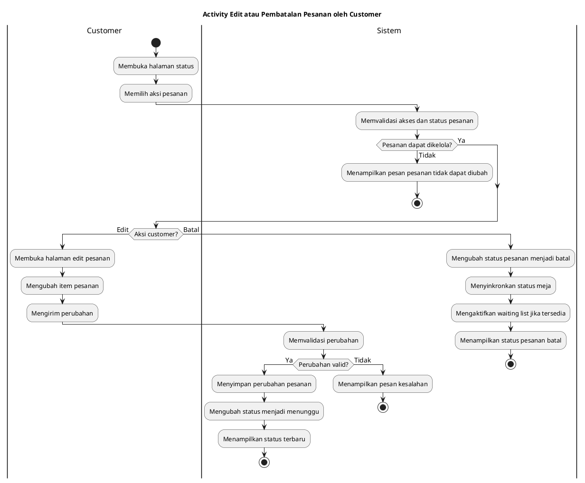

## 6. Proses Pesanan pada Kitchen Display

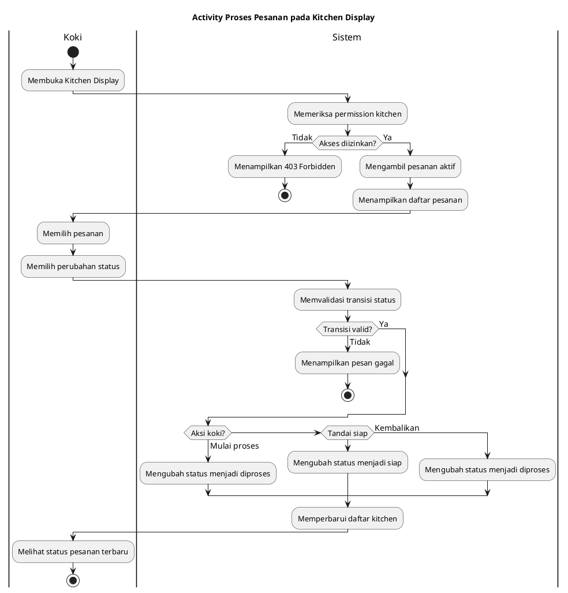

## 7. Pembayaran Pesanan oleh Kasir

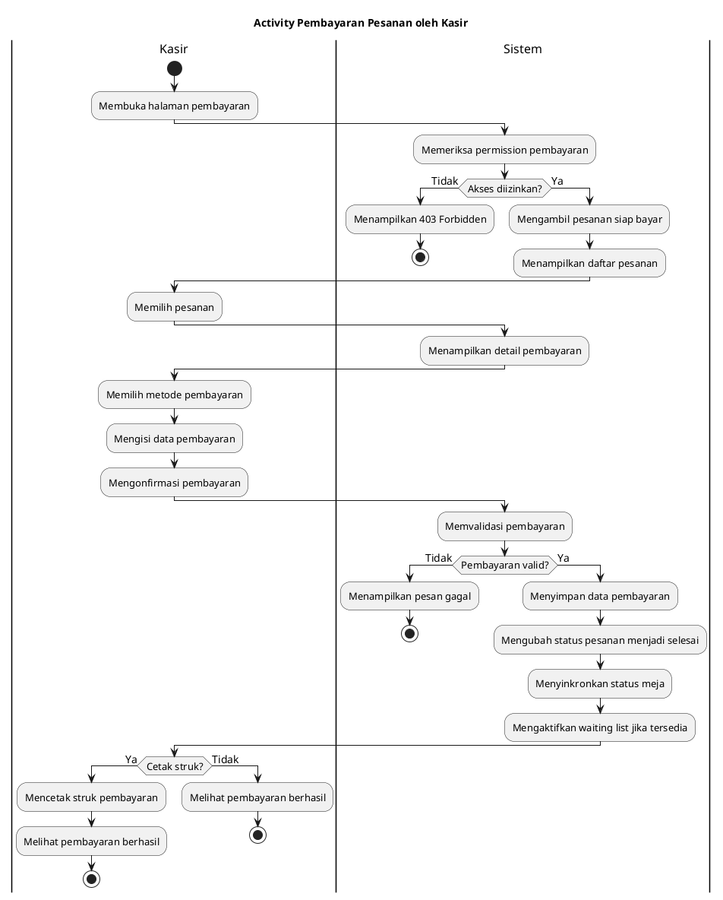

## 8. Customer Membuat Waiting List atau Booking Meja

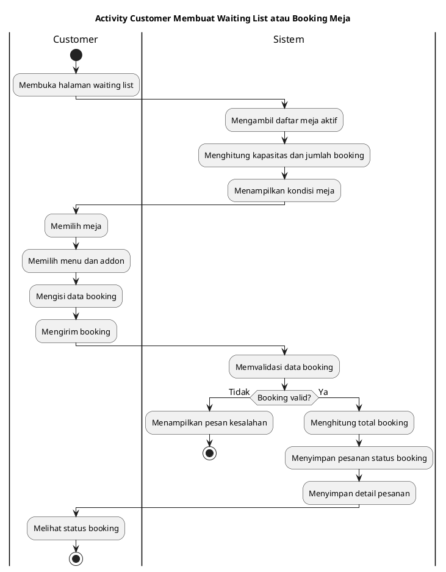

## 9. Admin atau Kasir Mengelola dan Mengaktifkan Waiting List

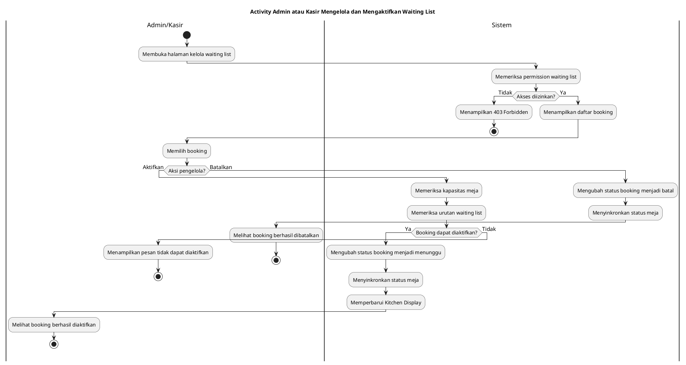

## 10. Admin atau Koki Mengelola Menu dan Addon

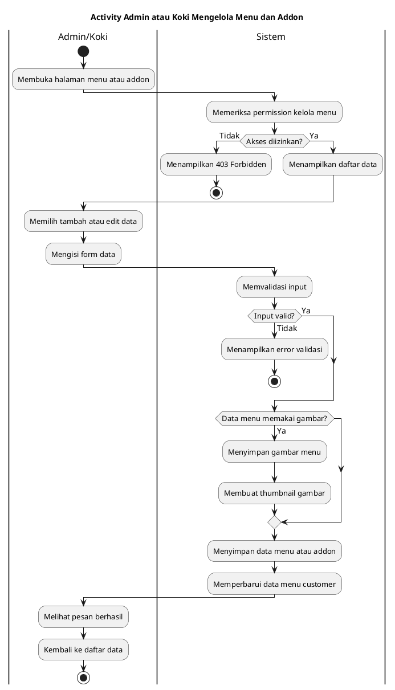

## 11. Admin Mengelola Meja dan QR Code

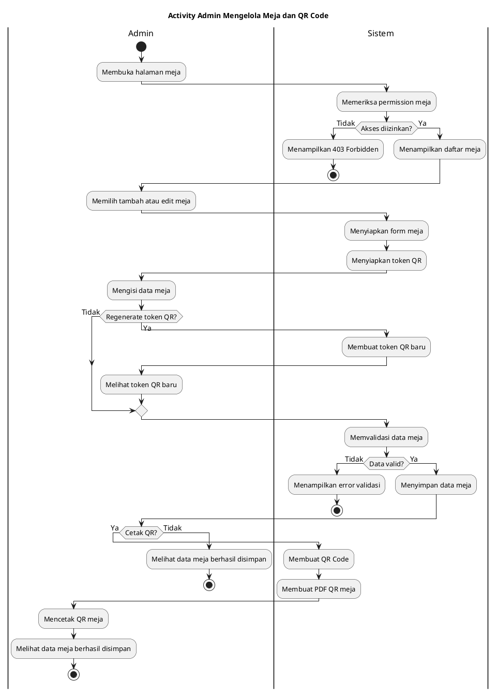
