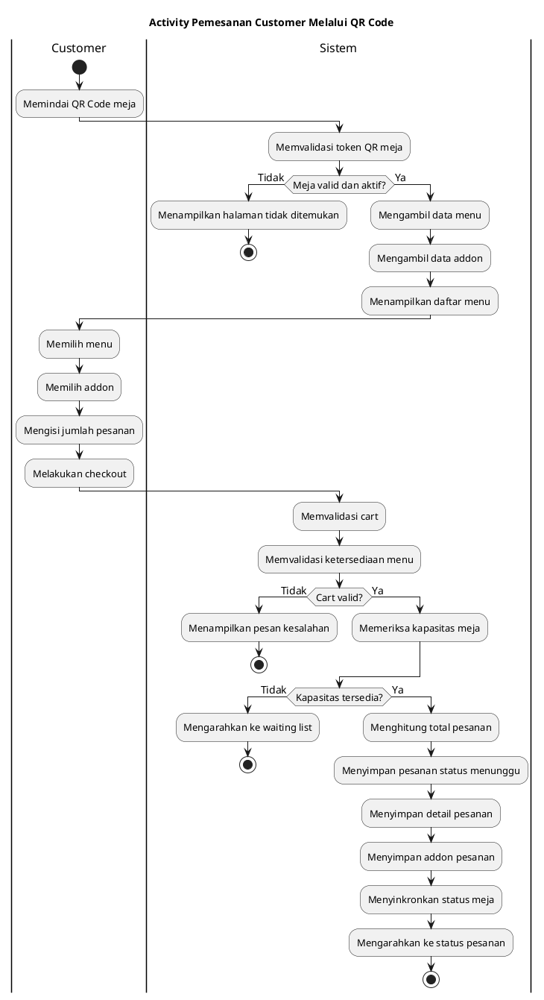
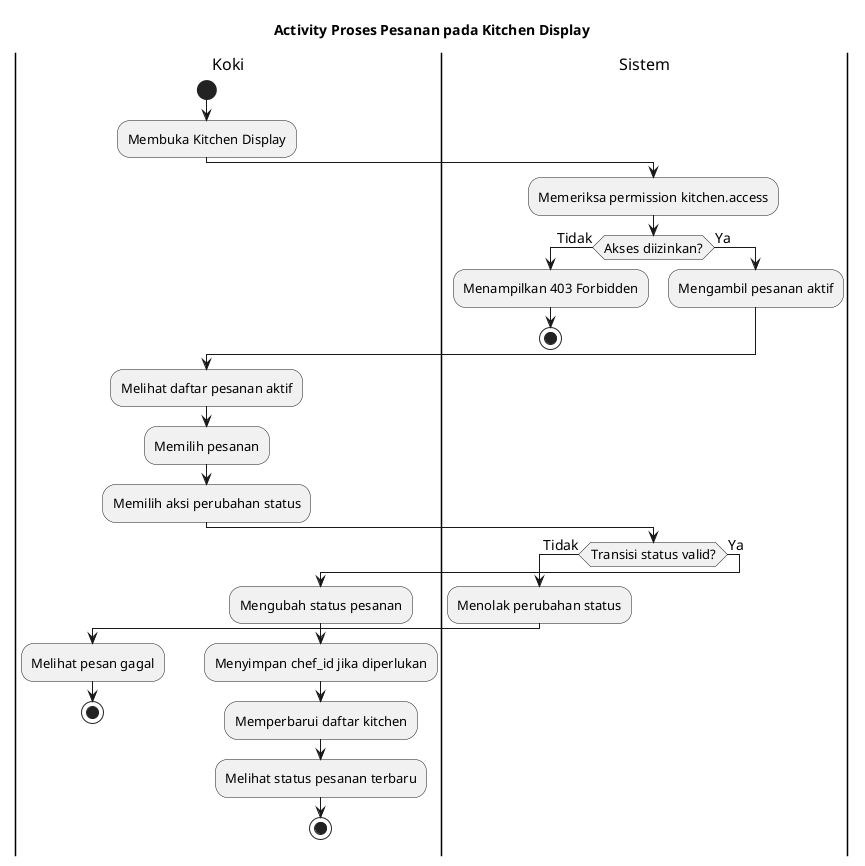
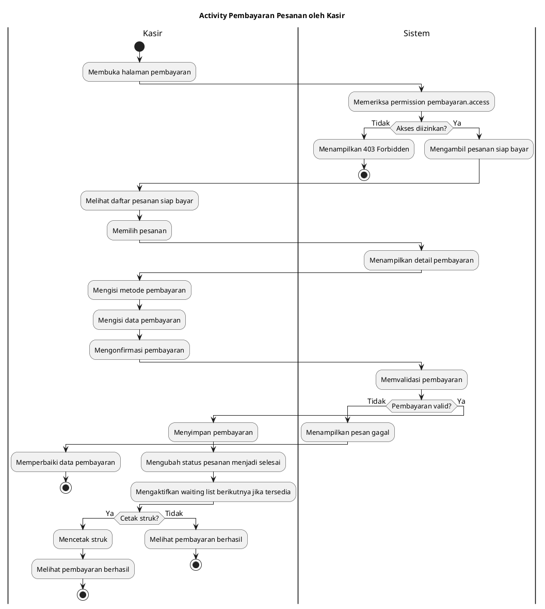
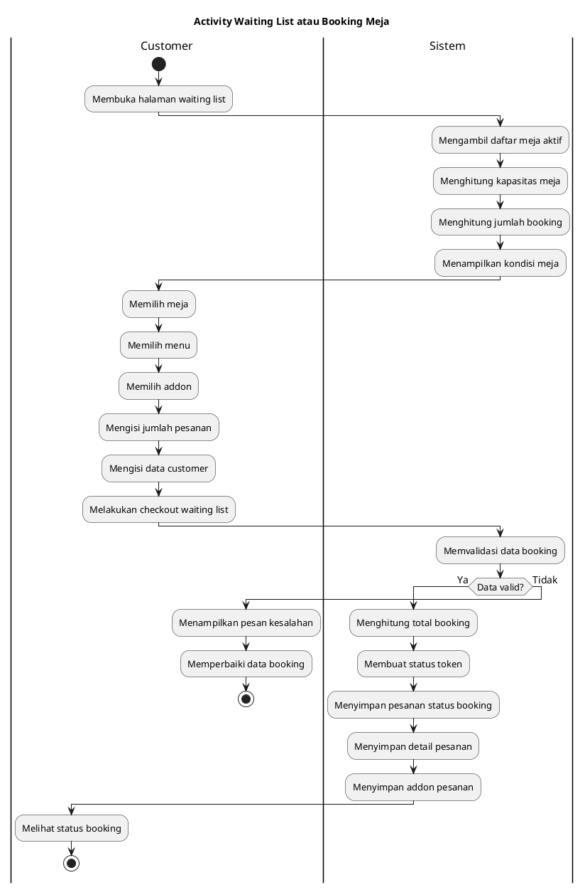
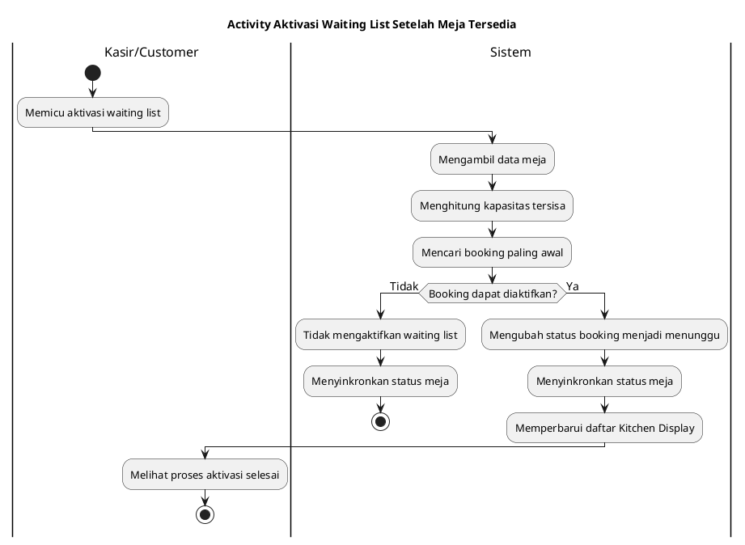
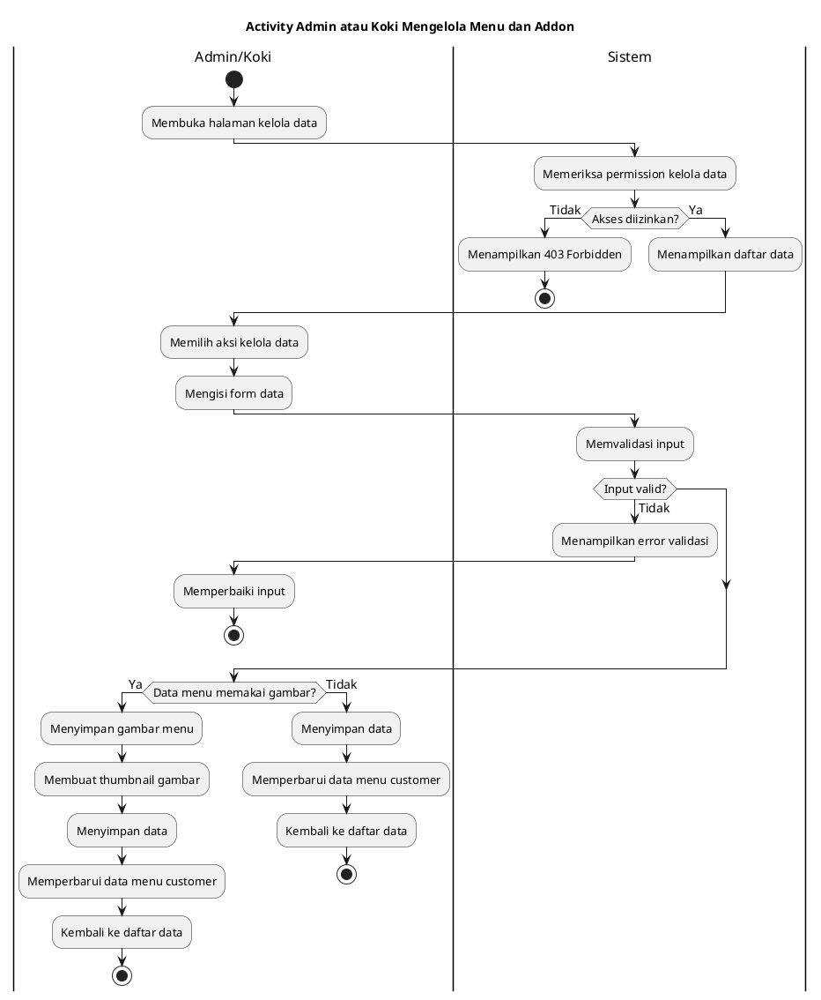
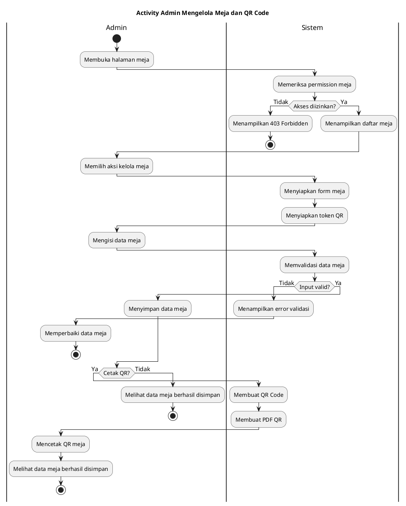
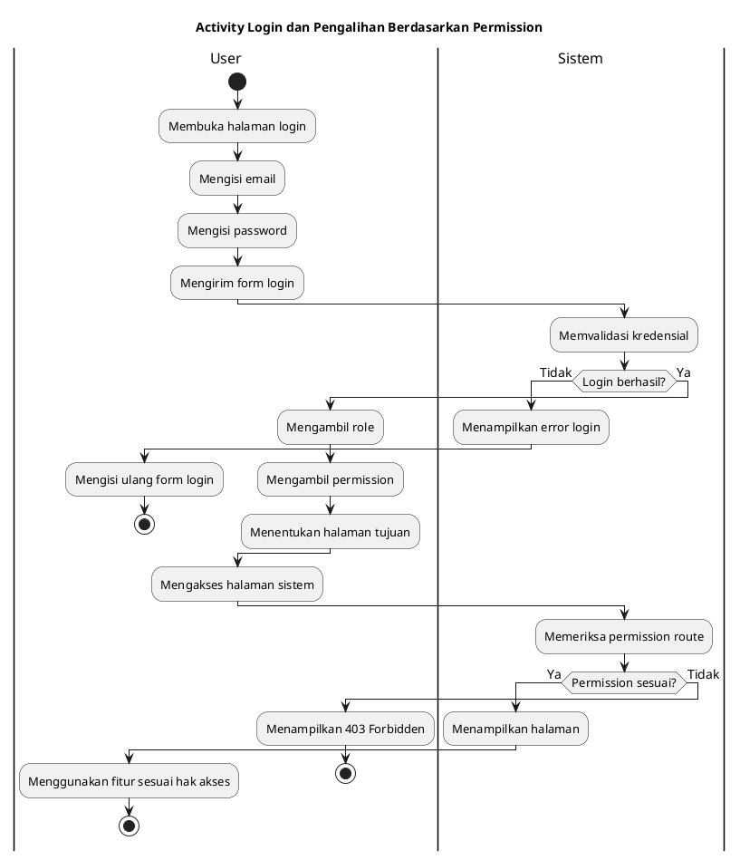

# Activity Diagram UML Warung Baleganjur - Versi Swimlane

Dokumen ini berisi Activity Diagram inti dalam bentuk swimlane.

Catatan:
- Diagram dibuat sederhana agar rapi untuk laporan tugas akhir.
- Swimlane digunakan untuk membedakan aktor dan sistem.
- Cabang dibuat berakhir sendiri jika perlu agar PlantUML tidak membuat merge/shape kosong.
- Detail teknis seperti cache, pagination, dan query internal tidak ditampilkan.

Style umum yang digunakan pada setiap diagram:
- `skinparam defaultFontName Arial`
- `skinparam defaultFontSize 14`
- `skinparam activityFontSize 13`
- `skinparam swimlaneTitleFontSize 16`

## 1. Pemesanan Customer Melalui QR Code

Acuan sequence: **Pemesanan Customer Melalui QR Code**



## 2. Pemantauan, Edit, dan Pembatalan Pesanan oleh Customer

Acuan sequence: **Pemantauan Status Pesanan oleh Customer**

```plantuml
@startuml
title Activity Pemantauan, Edit, dan Pembatalan Pesanan oleh Customer

skinparam defaultFontName Arial
skinparam defaultFontSize 14
skinparam activityFontSize 13
skinparam swimlaneTitleFontSize 16


|Customer|
start
:Membuka halaman status pesanan;

|Sistem|
:Memvalidasi token;
:Mengambil data pesanan;

if (Token valid?) then (Ya)
    :Menampilkan status terbaru;
else (Tidak)
    :Menampilkan halaman tidak ditemukan;
    stop
endif

|Customer|
:Melihat status pesanan;
:Memilih aksi lanjutan;

|Sistem|
if (Pesanan masih dapat dikelola?) then (Ya)
    :Menampilkan opsi aksi customer;
else (Tidak)
    :Menampilkan status akhir pesanan;
    stop
endif

|Customer|
if (Aksi customer?) then (Edit)
    :Mengubah pesanan;
    :Mengirim perubahan pesanan;
    |Sistem|
    :Memvalidasi perubahan;
    :Menyimpan perubahan pesanan;
    :Mengubah status menjadi menunggu;
    :Menampilkan status terbaru;
    stop
else (Batal)
    |Sistem|
    :Mengubah status pesanan menjadi batal;
    :Menyinkronkan status meja;
    :Mengaktifkan waiting list berikutnya jika tersedia;
    :Menampilkan status pesanan batal;
    stop
else (Pantau)
    |Sistem|
    :Menampilkan status terbaru;
    stop
endif

@enduml
```

## 3. Proses Pesanan pada Kitchen Display

Acuan sequence: **Proses Kitchen Display oleh Koki**



## 4. Pembayaran Pesanan oleh Kasir

Acuan sequence: **Pembayaran Pesanan oleh Kasir**



## 5. Waiting List atau Booking Meja

Acuan sequence: **Waiting List / Booking Meja**



## 6. Aktivasi Waiting List Setelah Meja Tersedia

Acuan sequence: **Aktivasi Waiting List Setelah Meja Tersedia**



## 7. Admin atau Koki Mengelola Menu dan Addon

Acuan sequence: **Admin atau Koki Mengelola Menu dan Addon**



## 8. Admin Mengelola Meja dan QR Code

Acuan sequence: **Admin Mengelola Meja dan QR Code**



## 9. Login dan Pengalihan Berdasarkan Permission

Acuan sequence: **Login dan Redirect Berdasarkan Permission**


