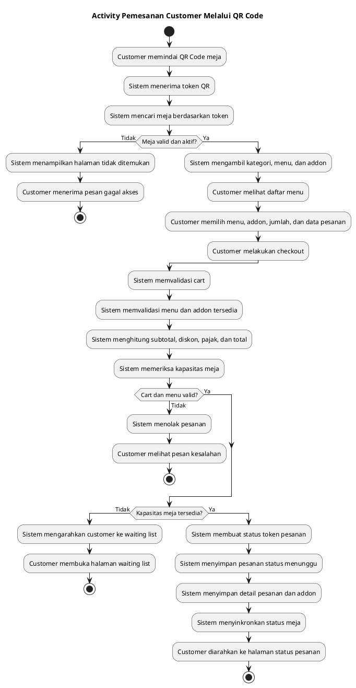
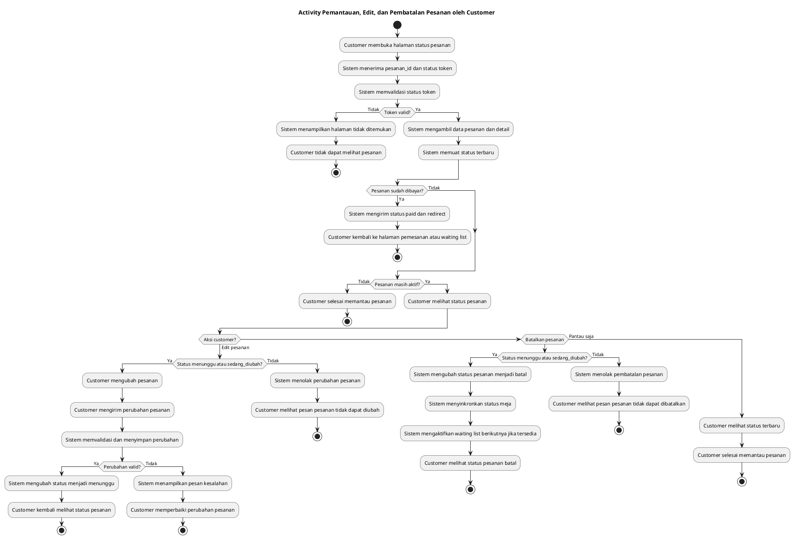
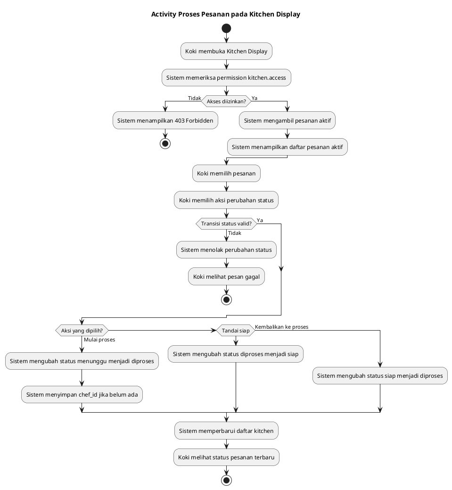
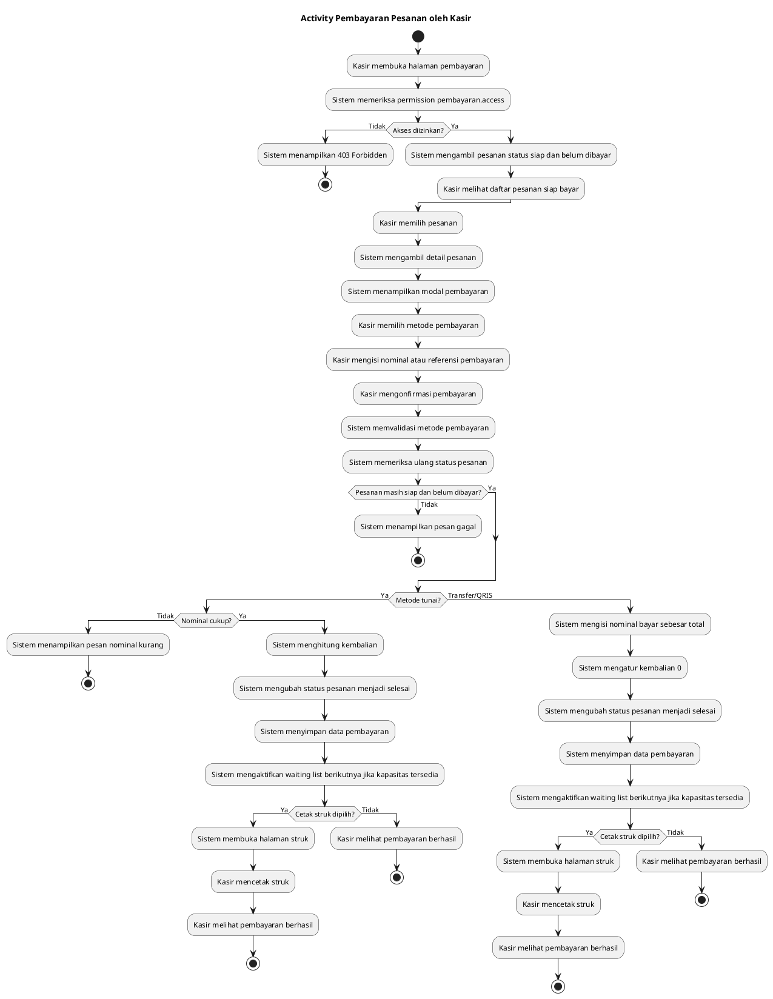
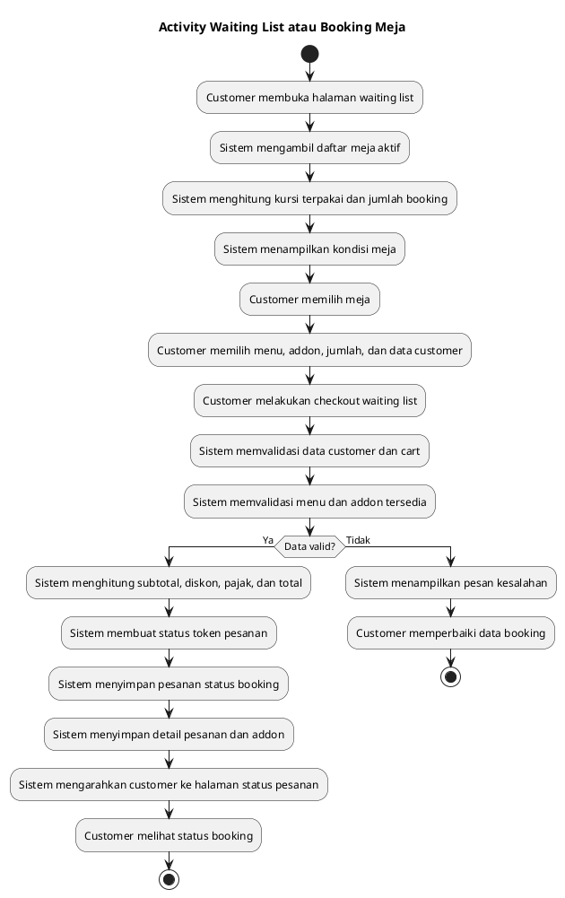
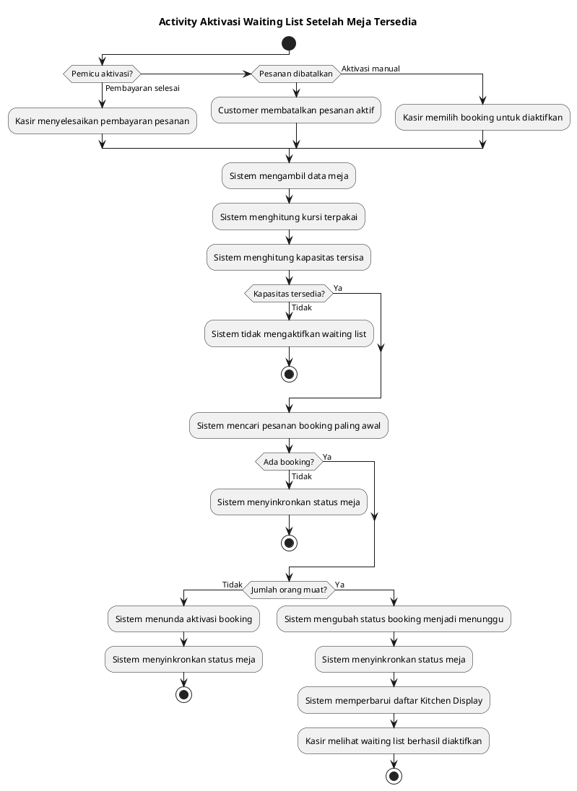
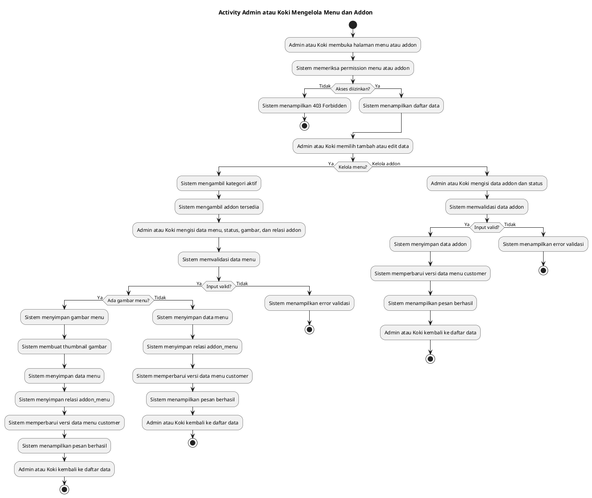
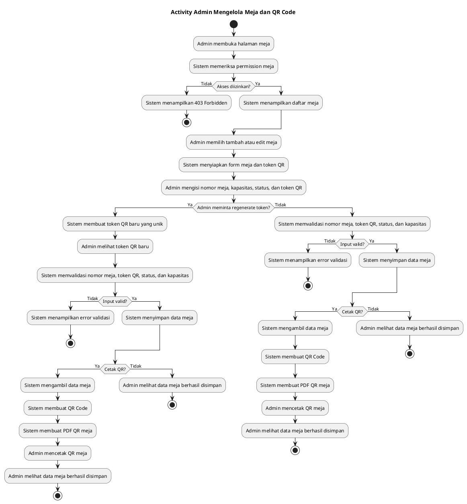
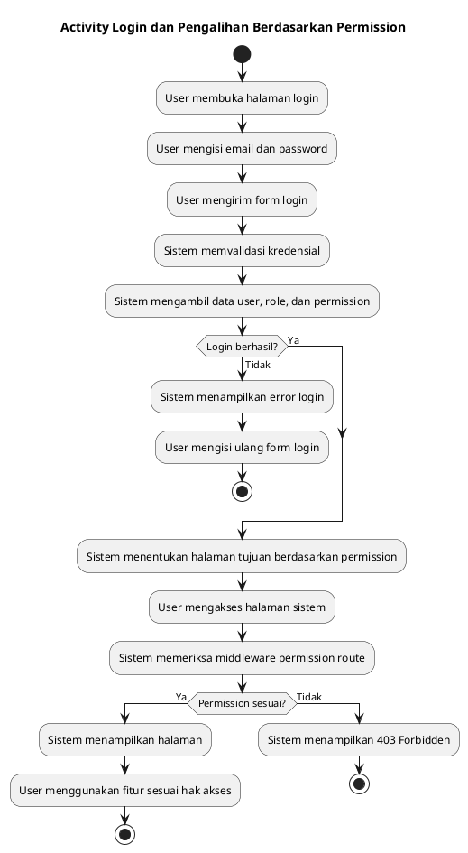

# Activity Diagram UML Warung Baleganjur - Versi Vertikal

Dokumen ini berisi versi vertikal dari Activity Diagram inti Sistem Informasi Pemesanan Warung Baleganjur.

Catatan:
- Diagram tidak menggunakan swimlane agar alurnya lebih rapi dan garis tidak banyak bersilangan.
- Aktor tetap ditulis pada nama aktivitas, misalnya `Customer`, `Sistem`, `Koki`, `Kasir`, dan `Admin`.
- Status pesanan mengikuti kode project: `booking`, `menunggu`, `sedang_diubah`, `diproses`, `siap`, `selesai`, dan `batal`.

## 1. Pemesanan Customer Melalui QR Code

Acuan sequence: **Pemesanan Customer Melalui QR Code**

## 2. Pemantauan, Edit, dan Pembatalan Pesanan oleh Customer

Acuan sequence: **Pemantauan Status Pesanan oleh Customer**

## 3. Proses Pesanan pada Kitchen Display

Acuan sequence: **Proses Kitchen Display oleh Koki**

## 4. Pembayaran Pesanan oleh Kasir

Acuan sequence: **Pembayaran Pesanan oleh Kasir**

## 5. Waiting List atau Booking Meja

Acuan sequence: **Waiting List / Booking Meja**

## 6. Aktivasi Waiting List Setelah Meja Tersedia

Acuan sequence: **Aktivasi Waiting List Setelah Meja Tersedia**

## 7. Admin atau Koki Mengelola Menu dan Addon

Acuan sequence: **Admin atau Koki Mengelola Menu dan Addon**

## 8. Admin Mengelola Meja dan QR Code

Acuan sequence: **Admin Mengelola Meja dan QR Code**

## 9. Login dan Pengalihan Berdasarkan Permission

Acuan sequence: **Login dan Redirect Berdasarkan Permission**

