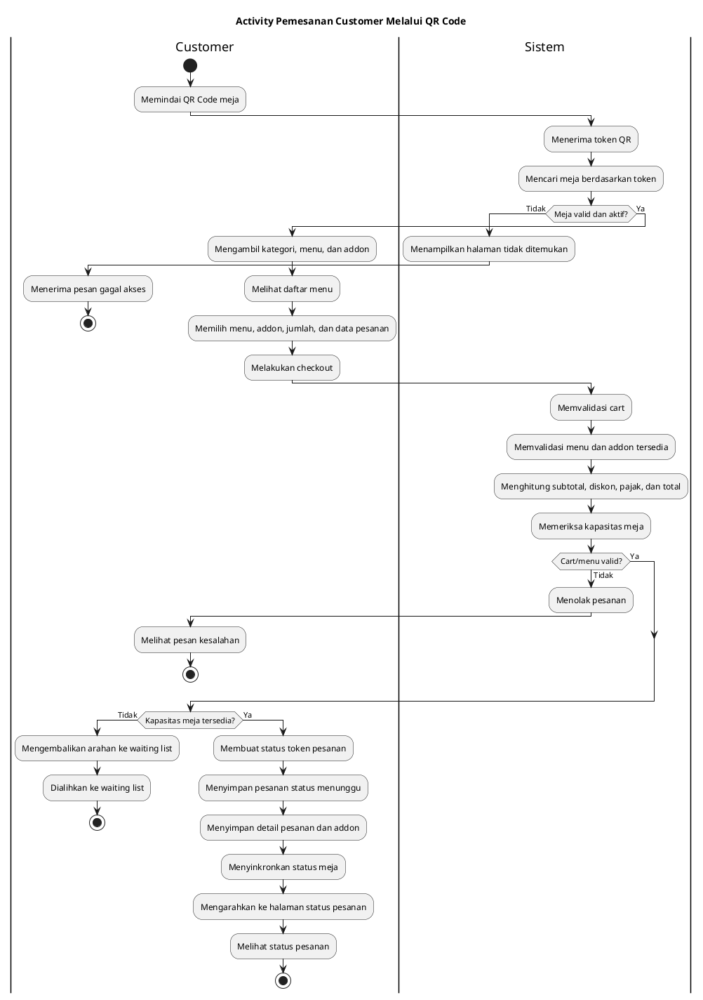
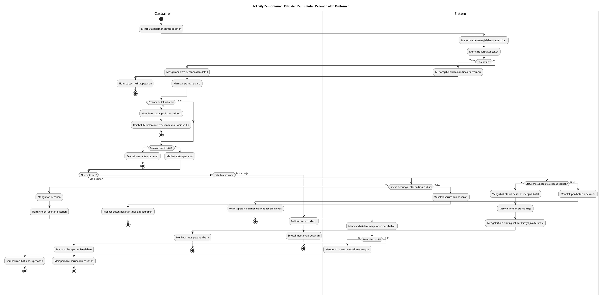
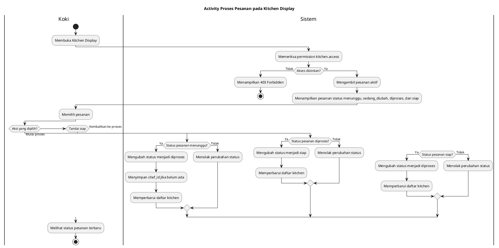
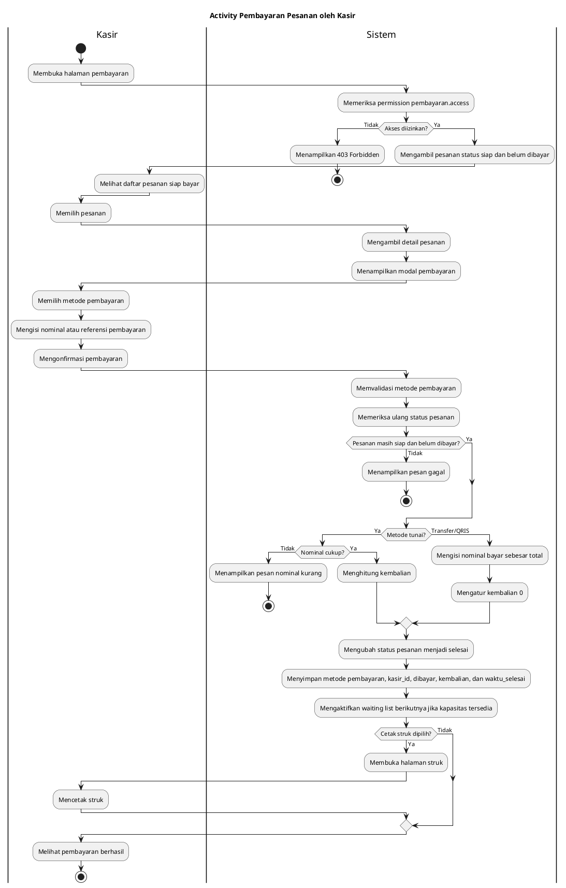
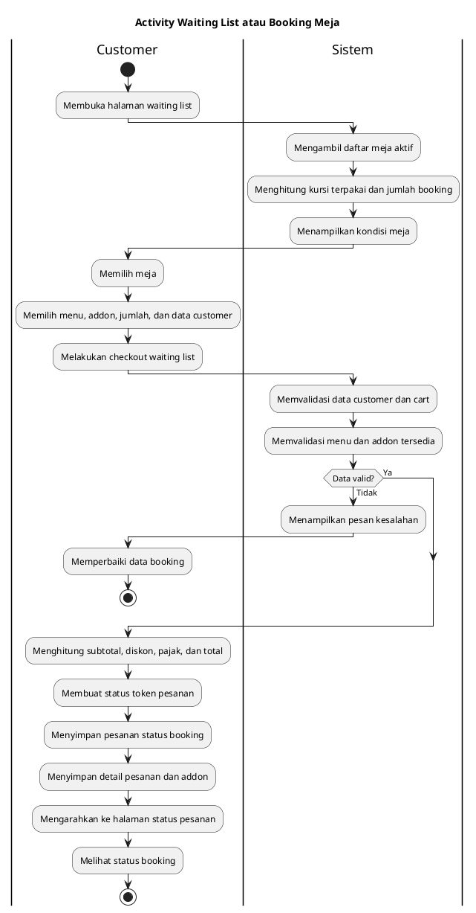
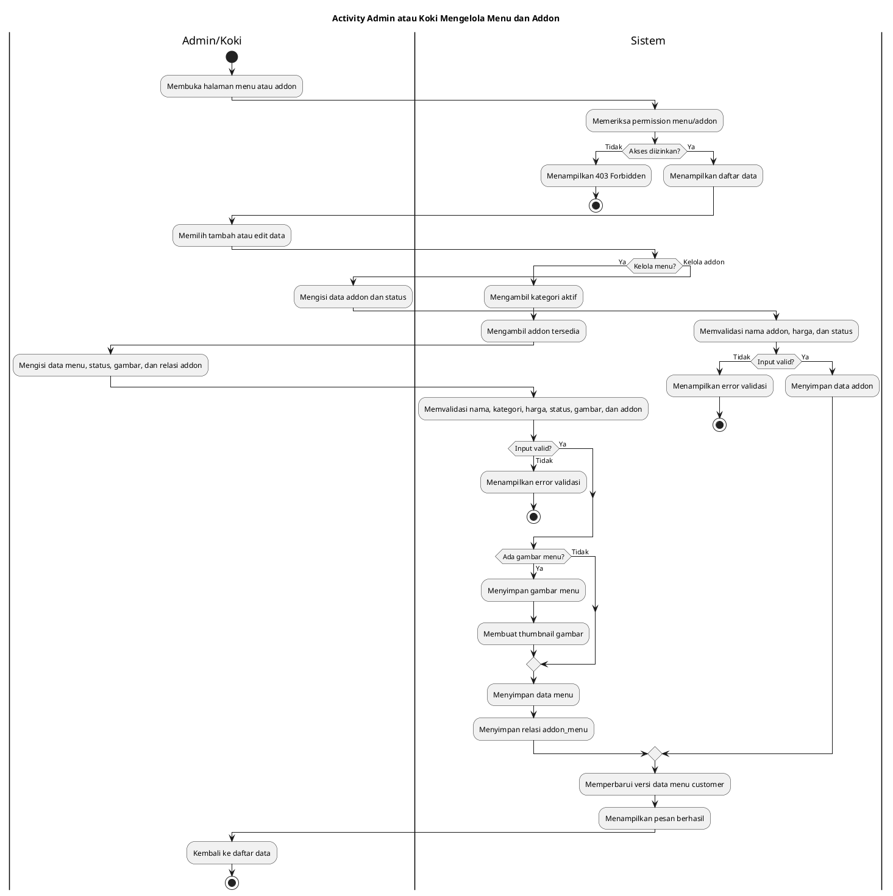
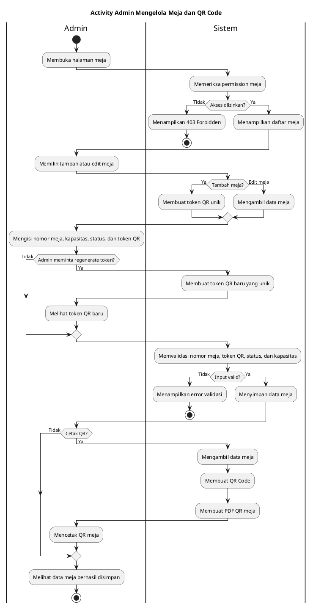
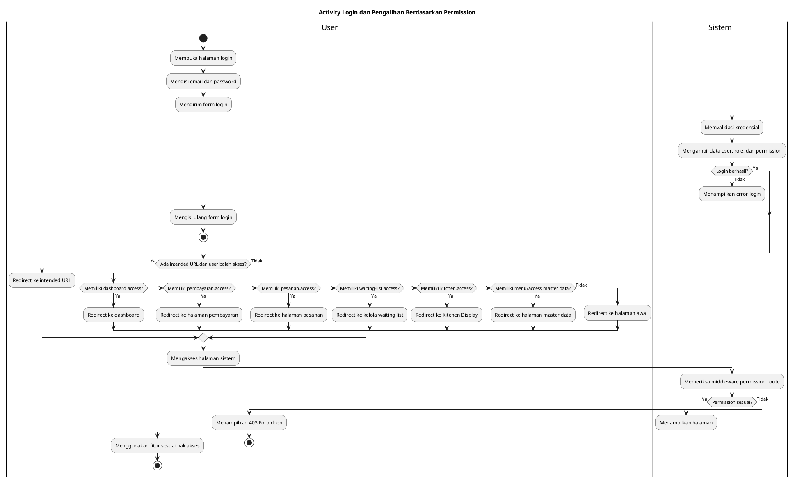

# Activity Diagram UML Warung Baleganjur

Dokumen ini berisi Activity Diagram inti untuk Sistem Informasi Pemesanan Warung Baleganjur berbasis QR Code dan Kitchen Display.

Acuan utama:
- Sequence Diagram pada `docs/sequence-diagrams-plantuml.md`.
- Struktur route, model, migration, middleware, Livewire/Volt component, dan service pada project.

Catatan:
- Diagram dibuat ringkas agar mudah dimasukkan ke laporan tugas akhir.
- Detail teknis seperti cache, pagination, dan rendering UI diringkas.
- Status pesanan mengikuti kode project: `booking`, `menunggu`, `sedang_diubah`, `diproses`, `siap`, `selesai`, dan `batal`.
- Status meja mengikuti kode project: `kosong`, `terisi`, `reservasi`, dan `nonaktif`.

## 1. Pemesanan Customer Melalui QR Code

Acuan sequence: **Pemesanan Customer Melalui QR Code**



## 2. Pemantauan, Edit, dan Pembatalan Pesanan oleh Customer

Acuan sequence: **Pemantauan Status Pesanan oleh Customer**



## 3. Proses Pesanan pada Kitchen Display

Acuan sequence: **Proses Kitchen Display oleh Koki**



## 4. Pembayaran Pesanan oleh Kasir

Acuan sequence: **Pembayaran Pesanan oleh Kasir**



## 5. Waiting List atau Booking Meja

Acuan sequence: **Waiting List / Booking Meja**



## 6. Aktivasi Waiting List Setelah Meja Tersedia

Acuan sequence: **Aktivasi Waiting List Setelah Meja Tersedia**

```plantuml
@startuml
title Activity Aktivasi Waiting List Setelah Meja Tersedia

start

if (Pemicu aktivasi?) then (Pembayaran selesai)
    |Kasir|
    :Menyelesaikan pembayaran pesanan;
elseif (Pesanan dibatalkan)
    |Customer|
    :Membatalkan pesanan aktif;
else (Aktivasi manual)
    |Kasir|
    :Memilih booking untuk diaktifkan;
endif

|Sistem|
:Mengambil data meja;
:Menghitung kursi terpakai;
:Menghitung kapasitas tersisa;

if (Kapasitas tersedia?) then (Tidak)
    :Tidak mengaktifkan waiting list;
    stop
else (Ya)
endif

:Mencari pesanan booking paling awal;

if (Ada booking?) then (Tidak)
    :Menyinkronkan status meja;
    stop
else (Ya)
endif

if (Jumlah orang muat?) then (Tidak)
    :Menunda aktivasi booking;
    :Menyinkronkan status meja;
    stop
else (Ya)
    :Mengubah status booking menjadi menunggu;
    :Menyinkronkan status meja;
    :Memperbarui daftar Kitchen Display;
endif

|Kasir|
:Melihat waiting list berhasil diaktifkan;
stop

@enduml
```

## 7. Admin atau Koki Mengelola Menu dan Addon

Acuan sequence: **Admin atau Koki Mengelola Menu dan Addon**



## 8. Admin Mengelola Meja dan QR Code

Acuan sequence: **Admin Mengelola Meja dan QR Code**



## 9. Login dan Pengalihan Berdasarkan Permission

Acuan sequence: **Login dan Redirect Berdasarkan Permission**


