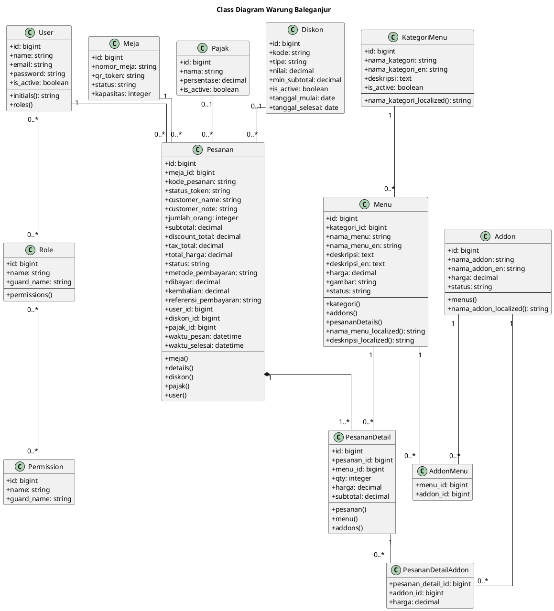

# Class Diagram UML Warung Baleganjur

Dokumen ini berisi class diagram PlantUML berdasarkan ERD, model Laravel, migration, dan alur sistem Warung Baleganjur.

Catatan:
- Diagram difokuskan pada class domain utama.
- Field teknis berulang seperti `created_at` dan `updated_at` tidak ditampilkan agar diagram tetap mudah dibaca.
- Relasi dibuat sederhana agar diagram tetap rapi dan mudah dibaca pada laporan.

## Class Diagram

## Ringkasan Relasi

- `User` berelasi dengan `Pesanan` sebagai user internal yang menangani pesanan.
- `Meja` memiliki banyak `Pesanan`.
- `Pesanan` memiliki banyak `PesananDetail`.
- `Menu` memiliki banyak `PesananDetail`.
- `Menu` dan `Addon` berelasi many-to-many melalui `AddonMenu`.
- `PesananDetail` dan `Addon` berelasi many-to-many melalui `PesananDetailAddon`.
- `Pesanan` dapat menggunakan satu `Pajak` dan satu `Diskon`.
- `User`, `Role`, dan `Permission` mengikuti struktur hak akses dari Spatie Permission.
