# Sequence Diagram UML Warung Baleganjur

Dokumen ini berisi 15 sequence diagram PlantUML berdasarkan 15 use case utama sistem pada `activity diagram final.md`.

Catatan:
- Diagram dibuat sederhana agar mudah dimasukkan ke laporan tugas akhir.
- Detail teknis seperti service Laravel, query rinci, cache, session, token internal, dan struktur tabel tidak ditampilkan.
- Peserta utama diagram: aktor, halaman, sistem, dan database.

## 1. Melakukan Pemesanan Melalui QR Meja

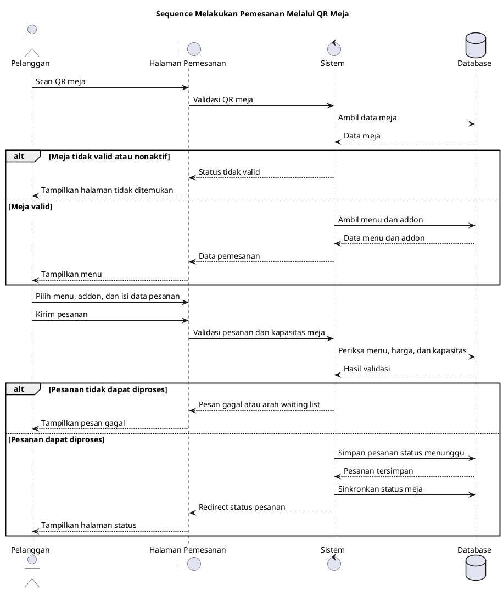
```plantuml
@startuml
title Sequence Melakukan Pemesanan Melalui QR Meja

skinparam defaultFontName Arial
skinparam defaultFontSize 14

actor Pelanggan
boundary "Halaman Pemesanan" as Page
control "Sistem" as System
database "Database" as DB

Pelanggan -> Page: Scan QR meja
Page -> System: Validasi QR meja
System -> DB: Ambil data meja
DB --> System: Data meja

alt Meja tidak valid atau nonaktif
    System --> Page: Status tidak valid
    Page --> Pelanggan: Tampilkan halaman tidak ditemukan
else Meja valid
    System -> DB: Ambil menu dan addon
    DB --> System: Data menu dan addon
    System --> Page: Data pemesanan
    Page --> Pelanggan: Tampilkan menu
end

Pelanggan -> Page: Pilih menu, addon, dan isi data pesanan
Pelanggan -> Page: Kirim pesanan
Page -> System: Validasi pesanan dan kapasitas meja
System -> DB: Periksa menu, harga, dan kapasitas
DB --> System: Hasil validasi

alt Pesanan tidak dapat diproses
    System --> Page: Pesan gagal atau arah waiting list
    Page --> Pelanggan: Tampilkan pesan gagal
else Pesanan dapat diproses
    System -> DB: Simpan pesanan status menunggu
    DB --> System: Pesanan tersimpan
    System -> DB: Sinkronkan status meja
    System --> Page: Redirect status pesanan
    Page --> Pelanggan: Tampilkan halaman status
end

@enduml
```

## 2. Melihat Status Pesanan

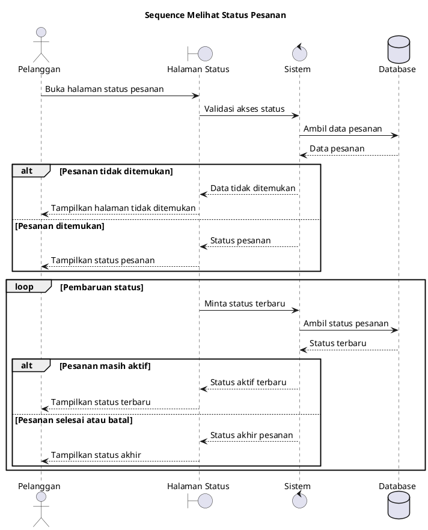
```plantuml
@startuml
title Sequence Melihat Status Pesanan

skinparam defaultFontName Arial
skinparam defaultFontSize 14

actor Pelanggan
boundary "Halaman Status" as Page
control "Sistem" as System
database "Database" as DB

Pelanggan -> Page: Buka halaman status pesanan
Page -> System: Validasi akses status
System -> DB: Ambil data pesanan
DB --> System: Data pesanan

alt Pesanan tidak ditemukan
    System --> Page: Data tidak ditemukan
    Page --> Pelanggan: Tampilkan halaman tidak ditemukan
else Pesanan ditemukan
    System --> Page: Status pesanan
    Page --> Pelanggan: Tampilkan status pesanan
end

loop Pembaruan status
    Page -> System: Minta status terbaru
    System -> DB: Ambil status pesanan
    DB --> System: Status terbaru

    alt Pesanan masih aktif
        System --> Page: Status aktif terbaru
        Page --> Pelanggan: Tampilkan status terbaru
    else Pesanan selesai atau batal
        System --> Page: Status akhir pesanan
        Page --> Pelanggan: Tampilkan status akhir
    end
end

@enduml
```

## 3. Mengubah Pesanan

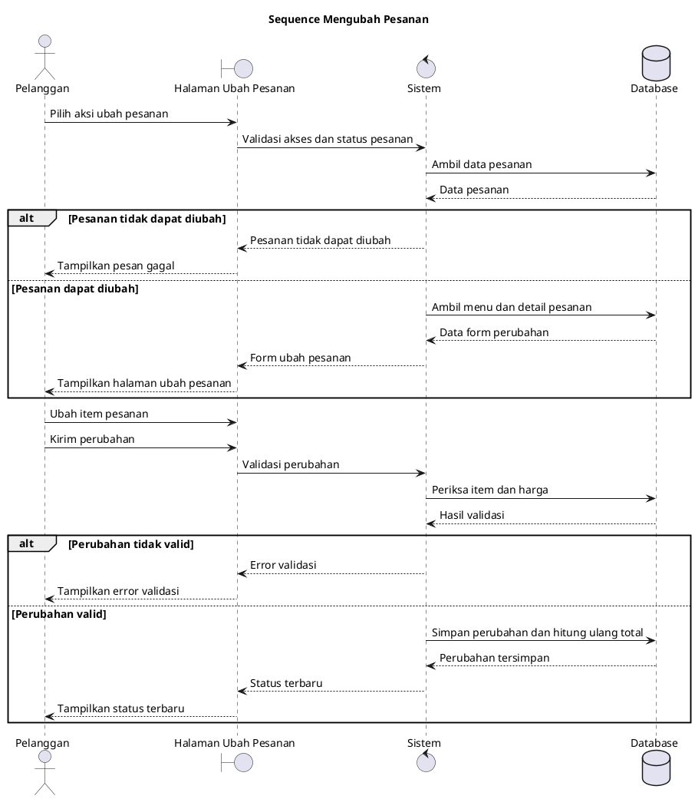
```plantuml
@startuml
title Sequence Mengubah Pesanan

skinparam defaultFontName Arial
skinparam defaultFontSize 14

actor Pelanggan
boundary "Halaman Ubah Pesanan" as Page
control "Sistem" as System
database "Database" as DB

Pelanggan -> Page: Pilih aksi ubah pesanan
Page -> System: Validasi akses dan status pesanan
System -> DB: Ambil data pesanan
DB --> System: Data pesanan

alt Pesanan tidak dapat diubah
    System --> Page: Pesanan tidak dapat diubah
    Page --> Pelanggan: Tampilkan pesan gagal
else Pesanan dapat diubah
    System -> DB: Ambil menu dan detail pesanan
    DB --> System: Data form perubahan
    System --> Page: Form ubah pesanan
    Page --> Pelanggan: Tampilkan halaman ubah pesanan
end

Pelanggan -> Page: Ubah item pesanan
Pelanggan -> Page: Kirim perubahan
Page -> System: Validasi perubahan
System -> DB: Periksa item dan harga
DB --> System: Hasil validasi

alt Perubahan tidak valid
    System --> Page: Error validasi
    Page --> Pelanggan: Tampilkan error validasi
else Perubahan valid
    System -> DB: Simpan perubahan dan hitung ulang total
    DB --> System: Perubahan tersimpan
    System --> Page: Status terbaru
    Page --> Pelanggan: Tampilkan status terbaru
end

@enduml
```

## 4. Membatalkan Pesanan

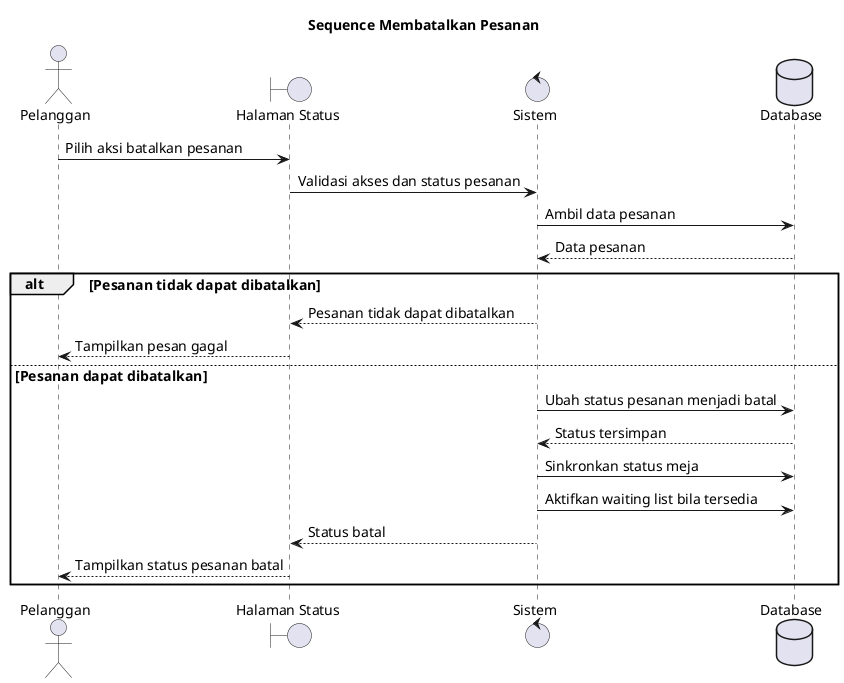
```plantuml
@startuml
title Sequence Membatalkan Pesanan

skinparam defaultFontName Arial
skinparam defaultFontSize 14

actor Pelanggan
boundary "Halaman Status" as Page
control "Sistem" as System
database "Database" as DB

Pelanggan -> Page: Pilih aksi batalkan pesanan
Page -> System: Validasi akses dan status pesanan
System -> DB: Ambil data pesanan
DB --> System: Data pesanan

alt Pesanan tidak dapat dibatalkan
    System --> Page: Pesanan tidak dapat dibatalkan
    Page --> Pelanggan: Tampilkan pesan gagal
else Pesanan dapat dibatalkan
    System -> DB: Ubah status pesanan menjadi batal
    DB --> System: Status tersimpan
    System -> DB: Sinkronkan status meja
    System -> DB: Aktifkan waiting list bila tersedia
    System --> Page: Status batal
    Page --> Pelanggan: Tampilkan status pesanan batal
end

@enduml
```

## 5. Membuat Waiting List

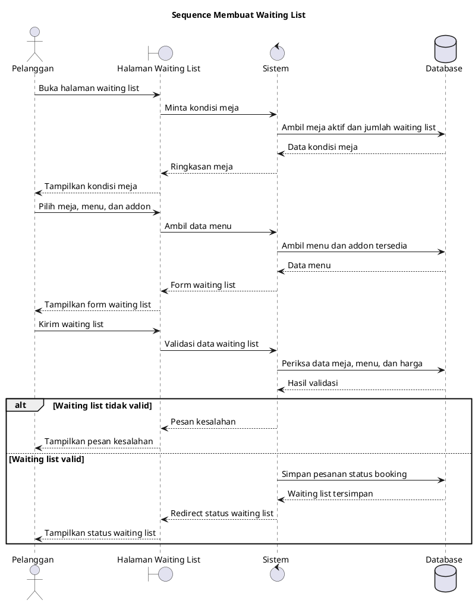
```plantuml
@startuml
title Sequence Membuat Waiting List

skinparam defaultFontName Arial
skinparam defaultFontSize 14

actor Pelanggan
boundary "Halaman Waiting List" as Page
control "Sistem" as System
database "Database" as DB

Pelanggan -> Page: Buka halaman waiting list
Page -> System: Minta kondisi meja
System -> DB: Ambil meja aktif dan jumlah waiting list
DB --> System: Data kondisi meja
System --> Page: Ringkasan meja
Page --> Pelanggan: Tampilkan kondisi meja

Pelanggan -> Page: Pilih meja, menu, dan addon
Page -> System: Ambil data menu
System -> DB: Ambil menu dan addon tersedia
DB --> System: Data menu
System --> Page: Form waiting list
Page --> Pelanggan: Tampilkan form waiting list

Pelanggan -> Page: Kirim waiting list
Page -> System: Validasi data waiting list
System -> DB: Periksa data meja, menu, dan harga
DB --> System: Hasil validasi

alt Waiting list tidak valid
    System --> Page: Pesan kesalahan
    Page --> Pelanggan: Tampilkan pesan kesalahan
else Waiting list valid
    System -> DB: Simpan pesanan status booking
    DB --> System: Waiting list tersimpan
    System --> Page: Redirect status waiting list
    Page --> Pelanggan: Tampilkan status waiting list
end

@enduml
```

## 6. Melakukan Login

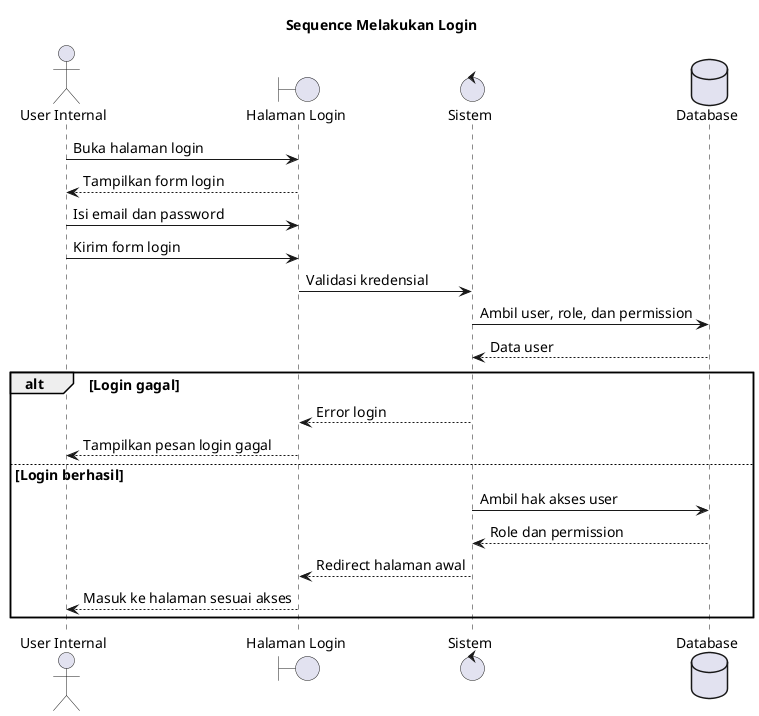
```plantuml
@startuml
title Sequence Melakukan Login

skinparam defaultFontName Arial
skinparam defaultFontSize 14

actor "User Internal" as UserInternal
boundary "Halaman Login" as Page
control "Sistem" as System
database "Database" as DB

UserInternal -> Page: Buka halaman login
Page --> UserInternal: Tampilkan form login
UserInternal -> Page: Isi email dan password
UserInternal -> Page: Kirim form login
Page -> System: Validasi kredensial
System -> DB: Ambil user, role, dan permission
DB --> System: Data user

alt Login gagal
    System --> Page: Error login
    Page --> UserInternal: Tampilkan pesan login gagal
else Login berhasil
    System -> DB: Ambil hak akses user
    DB --> System: Role dan permission
    System --> Page: Redirect halaman awal
    Page --> UserInternal: Masuk ke halaman sesuai akses
end

@enduml
```

## 7. Melihat Dashboard

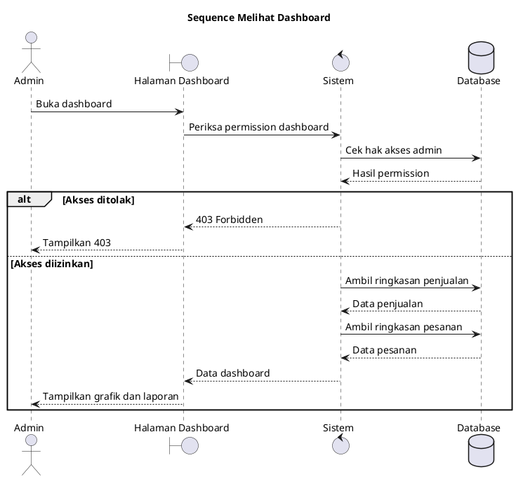
```plantuml
@startuml
title Sequence Melihat Dashboard

skinparam defaultFontName Arial
skinparam defaultFontSize 14

actor Admin
boundary "Halaman Dashboard" as Page
control "Sistem" as System
database "Database" as DB

Admin -> Page: Buka dashboard
Page -> System: Periksa permission dashboard
System -> DB: Cek hak akses admin
DB --> System: Hasil permission

alt Akses ditolak
    System --> Page: 403 Forbidden
    Page --> Admin: Tampilkan 403
else Akses diizinkan
    System -> DB: Ambil ringkasan penjualan
    DB --> System: Data penjualan
    System -> DB: Ambil ringkasan pesanan
    DB --> System: Data pesanan
    System --> Page: Data dashboard
    Page --> Admin: Tampilkan grafik dan laporan
end

@enduml
```

## 8. Mengelola Pesanan

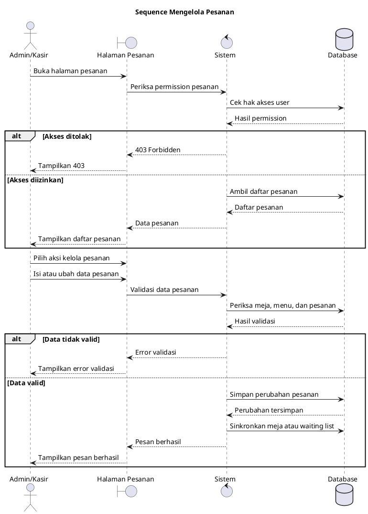
```plantuml
@startuml
title Sequence Mengelola Pesanan

skinparam defaultFontName Arial
skinparam defaultFontSize 14

actor "Admin/Kasir" as AdminKasir
boundary "Halaman Pesanan" as Page
control "Sistem" as System
database "Database" as DB

AdminKasir -> Page: Buka halaman pesanan
Page -> System: Periksa permission pesanan
System -> DB: Cek hak akses user
DB --> System: Hasil permission

alt Akses ditolak
    System --> Page: 403 Forbidden
    Page --> AdminKasir: Tampilkan 403
else Akses diizinkan
    System -> DB: Ambil daftar pesanan
    DB --> System: Daftar pesanan
    System --> Page: Data pesanan
    Page --> AdminKasir: Tampilkan daftar pesanan
end

AdminKasir -> Page: Pilih aksi kelola pesanan
AdminKasir -> Page: Isi atau ubah data pesanan
Page -> System: Validasi data pesanan
System -> DB: Periksa meja, menu, dan pesanan
DB --> System: Hasil validasi

alt Data tidak valid
    System --> Page: Error validasi
    Page --> AdminKasir: Tampilkan error validasi
else Data valid
    System -> DB: Simpan perubahan pesanan
    DB --> System: Perubahan tersimpan
    System -> DB: Sinkronkan meja atau waiting list
    System --> Page: Pesan berhasil
    Page --> AdminKasir: Tampilkan pesan berhasil
end

@enduml
```

## 9. Mengelola Kitchen Display

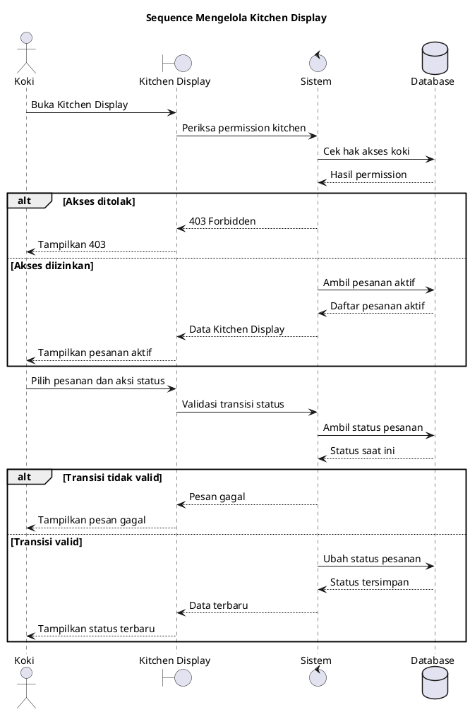
```plantuml
@startuml
title Sequence Mengelola Kitchen Display

skinparam defaultFontName Arial
skinparam defaultFontSize 14

actor Koki
boundary "Kitchen Display" as Page
control "Sistem" as System
database "Database" as DB

Koki -> Page: Buka Kitchen Display
Page -> System: Periksa permission kitchen
System -> DB: Cek hak akses koki
DB --> System: Hasil permission

alt Akses ditolak
    System --> Page: 403 Forbidden
    Page --> Koki: Tampilkan 403
else Akses diizinkan
    System -> DB: Ambil pesanan aktif
    DB --> System: Daftar pesanan aktif
    System --> Page: Data Kitchen Display
    Page --> Koki: Tampilkan pesanan aktif
end

Koki -> Page: Pilih pesanan dan aksi status
Page -> System: Validasi transisi status
System -> DB: Ambil status pesanan
DB --> System: Status saat ini

alt Transisi tidak valid
    System --> Page: Pesan gagal
    Page --> Koki: Tampilkan pesan gagal
else Transisi valid
    System -> DB: Ubah status pesanan
    DB --> System: Status tersimpan
    System --> Page: Data terbaru
    Page --> Koki: Tampilkan status terbaru
end

@enduml
```

## 10. Mengelola Pembayaran

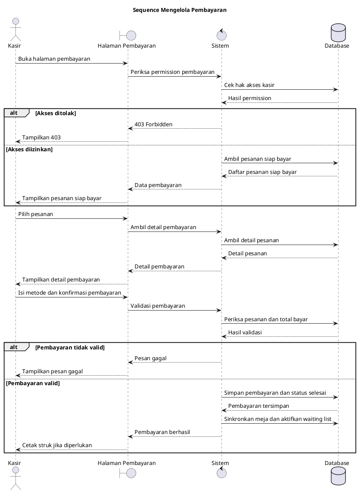
```plantuml
@startuml
title Sequence Mengelola Pembayaran

skinparam defaultFontName Arial
skinparam defaultFontSize 14

actor Kasir
boundary "Halaman Pembayaran" as Page
control "Sistem" as System
database "Database" as DB

Kasir -> Page: Buka halaman pembayaran
Page -> System: Periksa permission pembayaran
System -> DB: Cek hak akses kasir
DB --> System: Hasil permission

alt Akses ditolak
    System --> Page: 403 Forbidden
    Page --> Kasir: Tampilkan 403
else Akses diizinkan
    System -> DB: Ambil pesanan siap bayar
    DB --> System: Daftar pesanan siap bayar
    System --> Page: Data pembayaran
    Page --> Kasir: Tampilkan pesanan siap bayar
end

Kasir -> Page: Pilih pesanan
Page -> System: Ambil detail pembayaran
System -> DB: Ambil detail pesanan
DB --> System: Detail pesanan
System --> Page: Detail pembayaran
Page --> Kasir: Tampilkan detail pembayaran

Kasir -> Page: Isi metode dan konfirmasi pembayaran
Page -> System: Validasi pembayaran
System -> DB: Periksa pesanan dan total bayar
DB --> System: Hasil validasi

alt Pembayaran tidak valid
    System --> Page: Pesan gagal
    Page --> Kasir: Tampilkan pesan gagal
else Pembayaran valid
    System -> DB: Simpan pembayaran dan status selesai
    DB --> System: Pembayaran tersimpan
    System -> DB: Sinkronkan meja dan aktifkan waiting list
    System --> Page: Pembayaran berhasil
    Page --> Kasir: Cetak struk jika diperlukan
end

@enduml
```

## 11. Mengelola Waiting List

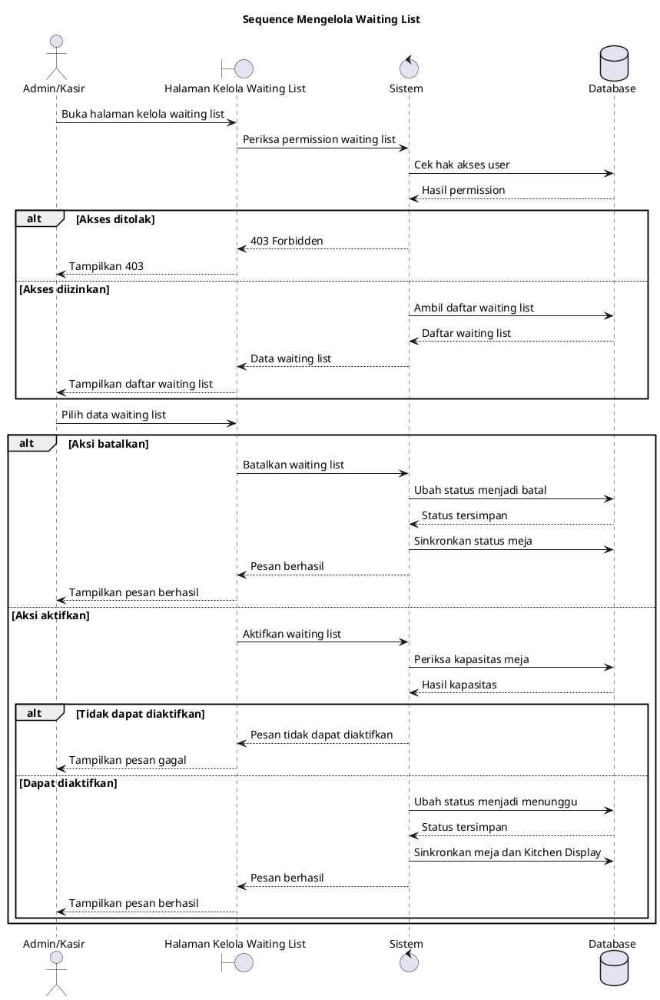
```plantuml
@startuml
title Sequence Mengelola Waiting List

skinparam defaultFontName Arial
skinparam defaultFontSize 14

actor "Admin/Kasir" as AdminKasir
boundary "Halaman Kelola Waiting List" as Page
control "Sistem" as System
database "Database" as DB

AdminKasir -> Page: Buka halaman kelola waiting list
Page -> System: Periksa permission waiting list
System -> DB: Cek hak akses user
DB --> System: Hasil permission

alt Akses ditolak
    System --> Page: 403 Forbidden
    Page --> AdminKasir: Tampilkan 403
else Akses diizinkan
    System -> DB: Ambil daftar waiting list
    DB --> System: Daftar waiting list
    System --> Page: Data waiting list
    Page --> AdminKasir: Tampilkan daftar waiting list
end

AdminKasir -> Page: Pilih data waiting list

alt Aksi batalkan
    Page -> System: Batalkan waiting list
    System -> DB: Ubah status menjadi batal
    DB --> System: Status tersimpan
    System -> DB: Sinkronkan status meja
    System --> Page: Pesan berhasil
    Page --> AdminKasir: Tampilkan pesan berhasil
else Aksi aktifkan
    Page -> System: Aktifkan waiting list
    System -> DB: Periksa kapasitas meja
    DB --> System: Hasil kapasitas

    alt Tidak dapat diaktifkan
        System --> Page: Pesan tidak dapat diaktifkan
        Page --> AdminKasir: Tampilkan pesan gagal
    else Dapat diaktifkan
        System -> DB: Ubah status menjadi menunggu
        DB --> System: Status tersimpan
        System -> DB: Sinkronkan meja dan Kitchen Display
        System --> Page: Pesan berhasil
        Page --> AdminKasir: Tampilkan pesan berhasil
    end
end

@enduml
```

## 12. Mengelola Menu dan Addon

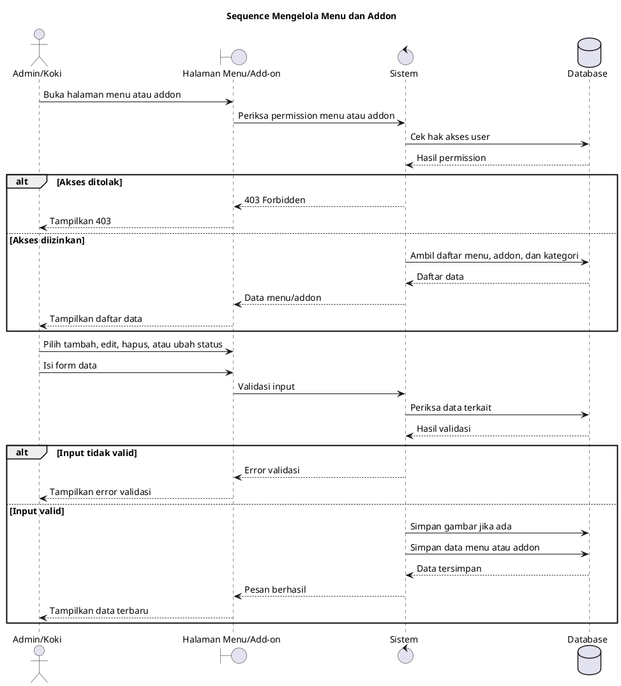
```plantuml
@startuml
title Sequence Mengelola Menu dan Addon

skinparam defaultFontName Arial
skinparam defaultFontSize 14

actor "Admin/Koki" as AdminKoki
boundary "Halaman Menu/Add-on" as Page
control "Sistem" as System
database "Database" as DB

AdminKoki -> Page: Buka halaman menu atau addon
Page -> System: Periksa permission menu atau addon
System -> DB: Cek hak akses user
DB --> System: Hasil permission

alt Akses ditolak
    System --> Page: 403 Forbidden
    Page --> AdminKoki: Tampilkan 403
else Akses diizinkan
    System -> DB: Ambil daftar menu, addon, dan kategori
    DB --> System: Daftar data
    System --> Page: Data menu/addon
    Page --> AdminKoki: Tampilkan daftar data
end

AdminKoki -> Page: Pilih tambah, edit, hapus, atau ubah status
AdminKoki -> Page: Isi form data
Page -> System: Validasi input
System -> DB: Periksa data terkait
DB --> System: Hasil validasi

alt Input tidak valid
    System --> Page: Error validasi
    Page --> AdminKoki: Tampilkan error validasi
else Input valid
    System -> DB: Simpan gambar jika ada
    System -> DB: Simpan data menu atau addon
    DB --> System: Data tersimpan
    System --> Page: Pesan berhasil
    Page --> AdminKoki: Tampilkan data terbaru
end

@enduml
```

## 13. Mengelola Data Referensi

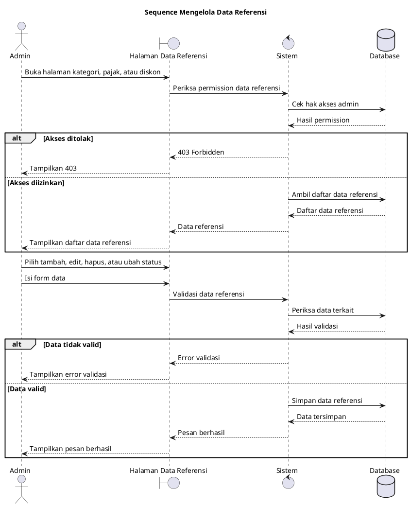
```plantuml
@startuml
title Sequence Mengelola Data Referensi

skinparam defaultFontName Arial
skinparam defaultFontSize 14

actor Admin
boundary "Halaman Data Referensi" as Page
control "Sistem" as System
database "Database" as DB

Admin -> Page: Buka halaman kategori, pajak, atau diskon
Page -> System: Periksa permission data referensi
System -> DB: Cek hak akses admin
DB --> System: Hasil permission

alt Akses ditolak
    System --> Page: 403 Forbidden
    Page --> Admin: Tampilkan 403
else Akses diizinkan
    System -> DB: Ambil daftar data referensi
    DB --> System: Daftar data referensi
    System --> Page: Data referensi
    Page --> Admin: Tampilkan daftar data referensi
end

Admin -> Page: Pilih tambah, edit, hapus, atau ubah status
Admin -> Page: Isi form data
Page -> System: Validasi data referensi
System -> DB: Periksa data terkait
DB --> System: Hasil validasi

alt Data tidak valid
    System --> Page: Error validasi
    Page --> Admin: Tampilkan error validasi
else Data valid
    System -> DB: Simpan data referensi
    DB --> System: Data tersimpan
    System --> Page: Pesan berhasil
    Page --> Admin: Tampilkan pesan berhasil
end

@enduml
```

## 14. Mengelola Meja dan QR Code

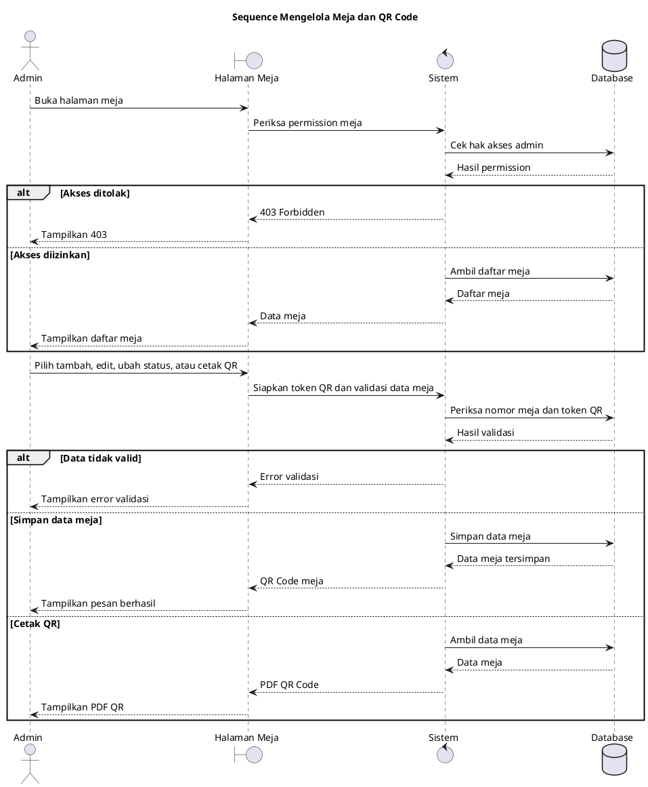
```plantuml
@startuml
title Sequence Mengelola Meja dan QR Code

skinparam defaultFontName Arial
skinparam defaultFontSize 14

actor Admin
boundary "Halaman Meja" as Page
control "Sistem" as System
database "Database" as DB

Admin -> Page: Buka halaman meja
Page -> System: Periksa permission meja
System -> DB: Cek hak akses admin
DB --> System: Hasil permission

alt Akses ditolak
    System --> Page: 403 Forbidden
    Page --> Admin: Tampilkan 403
else Akses diizinkan
    System -> DB: Ambil daftar meja
    DB --> System: Daftar meja
    System --> Page: Data meja
    Page --> Admin: Tampilkan daftar meja
end

Admin -> Page: Pilih tambah, edit, ubah status, atau cetak QR
Page -> System: Siapkan token QR dan validasi data meja
System -> DB: Periksa nomor meja dan token QR
DB --> System: Hasil validasi

alt Data tidak valid
    System --> Page: Error validasi
    Page --> Admin: Tampilkan error validasi
else Simpan data meja
    System -> DB: Simpan data meja
    DB --> System: Data meja tersimpan
    System --> Page: QR Code meja
    Page --> Admin: Tampilkan pesan berhasil
else Cetak QR
    System -> DB: Ambil data meja
    DB --> System: Data meja
    System --> Page: PDF QR Code
    Page --> Admin: Tampilkan PDF QR
end

@enduml
```

## 15. Mengelola User dan Hak Akses

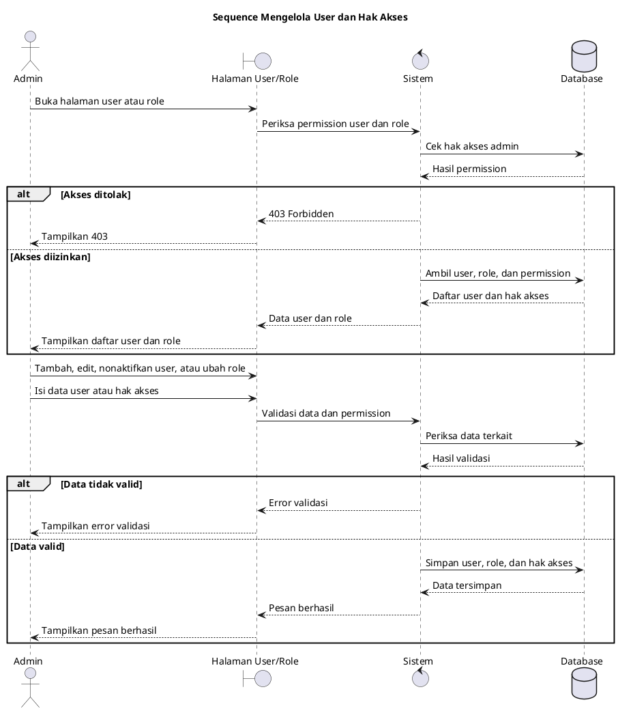
```plantuml
@startuml
title Sequence Mengelola User dan Hak Akses

skinparam defaultFontName Arial
skinparam defaultFontSize 14

actor Admin
boundary "Halaman User/Role" as Page
control "Sistem" as System
database "Database" as DB

Admin -> Page: Buka halaman user atau role
Page -> System: Periksa permission user dan role
System -> DB: Cek hak akses admin
DB --> System: Hasil permission

alt Akses ditolak
    System --> Page: 403 Forbidden
    Page --> Admin: Tampilkan 403
else Akses diizinkan
    System -> DB: Ambil user, role, dan permission
    DB --> System: Daftar user dan hak akses
    System --> Page: Data user dan role
    Page --> Admin: Tampilkan daftar user dan role
end

Admin -> Page: Tambah, edit, nonaktifkan user, atau ubah role
Admin -> Page: Isi data user atau hak akses
Page -> System: Validasi data dan permission
System -> DB: Periksa data terkait
DB --> System: Hasil validasi

alt Data tidak valid
    System --> Page: Error validasi
    Page --> Admin: Tampilkan error validasi
else Data valid
    System -> DB: Simpan user, role, dan hak akses
    DB --> System: Data tersimpan
    System --> Page: Pesan berhasil
    Page --> Admin: Tampilkan pesan berhasil
end

@enduml
```
