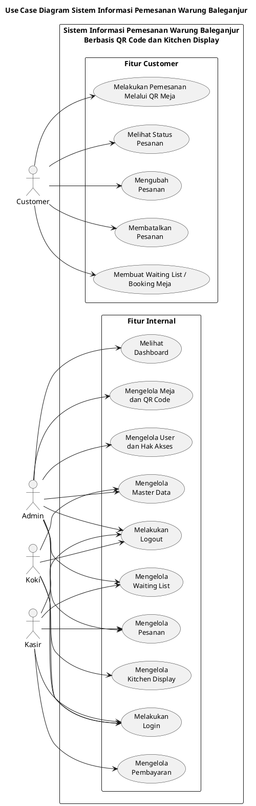

# Use Case Diagram UML Warung Baleganjur

Dokumen ini berisi use case diagram versi ringkas untuk Sistem Informasi Pemesanan Warung Baleganjur Berbasis QR Code dan Kitchen Display.

Diagram dibuat dalam satu sistem boundary dengan 15 use case utama:
- 5 use case Customer
- 10 use case Internal

