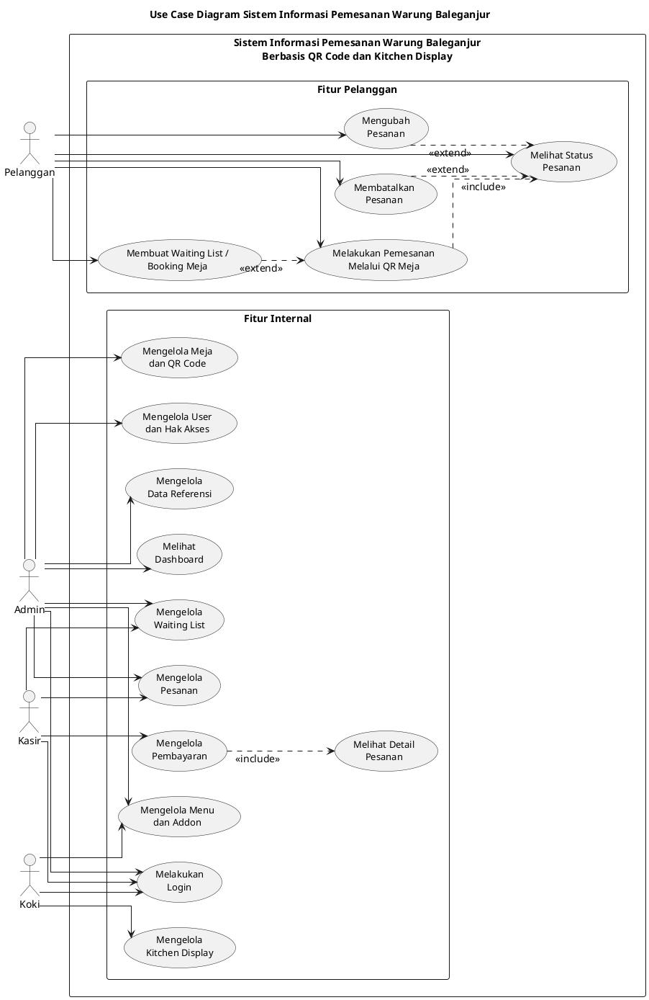

# Use Case Diagram UML Revisi Warung Baleganjur

Dokumen ini berisi use case diagram revisi untuk Sistem Informasi Pemesanan Warung Baleganjur Berbasis QR Code dan Kitchen Display.

Revisi utama:
- Aktor `Customer` diganti menjadi `Pelanggan`.
- Use case `Melakukan Logout` dihapus agar selaras dengan analisis proses dan activity diagram.
- Use case `Mengelola Master Data` dibuat lebih spesifik menjadi `Mengelola Menu dan Addon` serta `Mengelola Data Referensi`.
- Relasi `include` dan `extend` ditambahkan pada use case yang sesuai.

